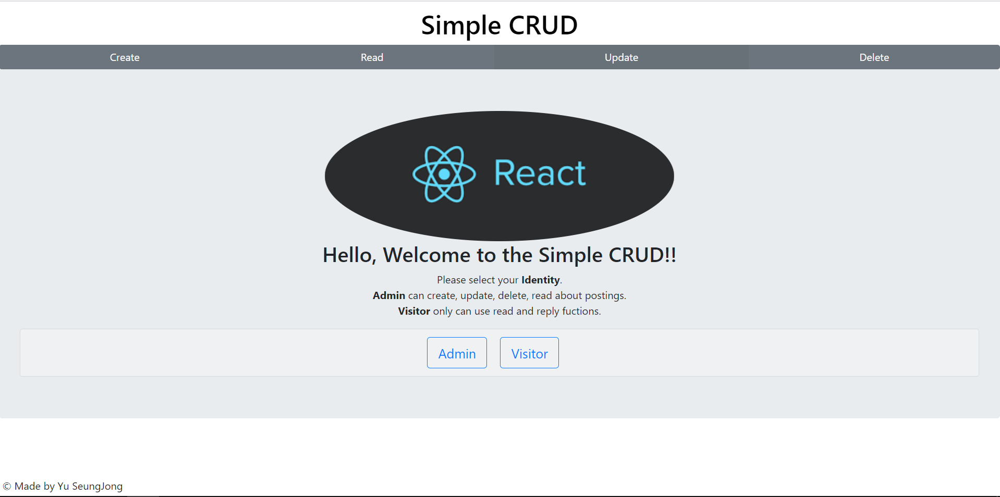
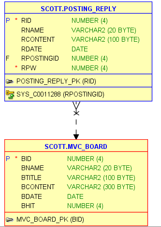

# Simple-CRUD-Project


made by 유승종

contact 010-4692-7597/fbtmdwhd33@naver.com
## 목차
* 들어가며
  1. 프로젝트 소개  
    1-1. 프로젝트 기능   
    1-2. 개발 환경    
    1-3. 프로젝트 작동구조   
    1-4. 실행영상
    
* Front-End(React)
  1. 컴포넌트 구성
  
* Back-End(Spring Framework)
  1. DataBase 테이블 설계
  2. Spring 설정파일 구성  
    2-1. web.xml<br/>
    2-2. servlet-context.xml
  3. View 구성
  4. Controller 구성
  5. Model 구성<br/>
    5-1. DTO 구성  
    5-2. DAO 구성 
  6. Interceptor 구성
  
* 마치며
  1. 프로젝트 보완사항
  2. 소감
  
## 들어가며
 #### 1. 프로젝트 소개
 
&nbsp;&nbsp;본 프로젝트를 시작하게 된 계기는 많은 분들이 이야기 하시는 웹 프로그래밍의 기본 소양이라 할 수 있는 기본적인 기능인 CRUD가 가능한 게시판을 목적으로 시작하게 된 프로젝트 입니다. 혼자 독학으로 관련 기술들을 학습한 이후 제작한 개인 프로젝트이기 때문에, 자신은 없지만 개인적인 만족감을 가지고 있는 프로젝트 입니다.
     
   #### 1-1. 프로젝트 기능
   
&nbsp;&nbsp;본 프로젝트의 초기에 구상한 기능은 가장 기본적인 기능인 CRUD 즉, 게시판에 올라오는 게시물을 대상으로 Create, Read, Update, Delete가 가능한 게시판이었습니다. 그러나 전부 완성되어 갈 때 쯤, 아쉬운 부분이 계속해서 생겨나서 몇몇 기능들을 추가하게 되었습니다. 아래가 그 내용입니다.
    
  * 초기 기능
    * 게시물을 작성하여 DataBase에 저장한다.
    * DataBase에서 게시물을 조회하여 웹 페이지 상에 표시한다.
    * 게시물을 수정하여 DataBase에 저장한다.
    * 게시물을 삭제할 시 DataBase에서 삭제한다.
    * SPA 구조에서 react-router를 이용한 라우팅 기능 제공.
    
  * 추가 기능
    * 웹 페이지 이용자를 2가지(Admin, Visitor)로 분류한다. 분류된 사용자들에게 제한된 기능을 제공한다.<br/>
     Admin - 게시판에 존재하는 게시물들에 대한 모든 기능에 접근 가능.<br/>
     Visitor - 게시판에 존재하는 게시물들에 대한 Read 기능 및 댓글 기능에 접근 가능.
    * Read 기능에서 페이징 처리를 통해 한 페이지 당 보여주는 게시물의 수를 10개로 제한
    * Read 기능에서 특정 게시물에 대한 댓글을 Create, Read, Update, Delete 가능하게 함.
    * Read 기능에서 특정 게시물을 제목으로 검색이 가능하게 함.<br/><br/>
    
   #### 1-2. 개발 환경
    
  &nbsp;&nbsp;운영 체제: window10<br/>
  &nbsp;&nbsp;IDE: Eclipse 4.12.0<br/>
  &nbsp;&nbsp;Back-end: Spring Framework 3.1.1.RELEASE, myBatis 3.2.8, Tomcat 7.0.96<br/>
  &nbsp;&nbsp;Front-end: React 16.12.0, React-bootstrap v1.0.0-beta 16<br/>
  &nbsp;&nbsp;Data Base: Oracle 11g Release 11.2.0.1.0, Sql Developer 19.2.1.247<br/>
  &nbsp;&nbsp;Module Bundler: Web Pack 4.41.5<br/>
  &nbsp;&nbsp;Web browser: Chrome<br/>
    
   #### 1-3. 프로젝트 작동구조
    
   &nbsp;&nbsp; 서버 사이드 렌더링인 SSR방식이 아닌, 클라이언트 사이드 렌더링인 CSR방식을 이용해 SPA 구조로 개발을 하고자 노력했습니다. 프로젝트의 기본적인 작동 구조는 Back-end에서 Spring Framework을 이용해 한 개의 jsp파일만을 view로써 제공을 하게 되는데, 해당 jsp 파일에 Front-end의 부분에서 SPA구조의 웹 페이지를 개발할 때 많이 사용되는 React의 Create React App을 기반으로 개발을 진행한 후, 작업한 파일들을  Web Pack을 이용해 번들링하여 포함시켜 주었습니다.
   
   &nbsp;&nbsp;사용자가 정보를 필요로 하는 경우 서버와의 ajax 비 동기 통신을 이용해 요청을 전달하고 서버는 myBatis를 이용해 mapper에 등록된 mapping interface에 해당하는 sql문을 이용해 Data Base에 접속하여 필요한 데이터를 추출하여 JSON형태로 전달하게 됩니다. 이 과정에서 Rest API를 적용하고자 노력하였으나, 해당 부분에 대한 이해가 미숙하여 일차적으로 HTTP Method인 GET, POST, PUT, DELETE만을 이용해 작성하였습니다.
   
   &nbsp;&nbsp; SPA구조가 가지는 문제점인 뒤로 가기, 앞으로 가기의 문제점은 React-Router를 이용해 React에서 특정 URL로 링크 시켜준 뒤 해당 링크와 일치하는 경우 특정 컴포넌트를 보여주는 방식으로 해결할 수 있었습니다.
   
   #### 1-4. 실행영상 
**아래의 이미지를 클릭해주세요.**

[](https://youtu.be/JgWCIUzCKHQ?t=0s) 

## Front-end(React)
 #### 1. 컴포넌트 구성
 
 &nbsp;&nbsp;우선 Front-end의 주요 폴더구조는 아래와 같습니다.
 
 >src<br/>
 >>main<br/>
 >>>jsx<br/>
 >>>>App.js<br/>
 >>>>index.js<br/>
 >>>>components<br/>
 >>>>>Header.js<br/>
 >>>>>Home.js<br/>
 >>>>>Footer.js<br/>
 >>>>>Selector.js<br/>
 >>>>>Article.js<br/>
 >>>>>Create.js<br/>
 >>>>>Read.js<br/>
 >>>>>Posting.js
 
 >>>>webapp<br/>
 >>>>>resources<br/>
 >>>>>>css<br/>
 >>>>>>>custom.css
 
 >>>>>>js<br/>
 >>>>>>>react<br/>
 >>>>>>>>index.bundle.js
 
 #### index.js
 
 ```jsx
import React from 'react';
import ReactDOM from 'react-dom';
import App from './App'; // App컴포넌트 호출
import '../include/bootstrap'; // react-bootstrap을 위한 호출
import '../webapp/resources/css/custom.css'; // css 호출
import { BrowserRouter as Router } from "react-router-dom"; // react-router의 라우팅을 위한 호출

ReactDOM.render(<Router><App /></Router>, document.getElementById('root')); // App 컴포넌트를 렌더링
```
&nbsp;&nbsp; Create React App의 기본 구조를 사용하였으며, 모든 컴포넌트를 포함하는 App컴포넌트를 Virtual Dom인 ReactDOM을 이용해 서버 측에서 넘겨준 jsp파일에서 id값이 root인 div태그 사이에 렌더링을 진행하게 됩니다.

#### App.js

```jsx
import ReactDOM from 'react-dom';
import Footer from './components/Footer'; // Footer 컴포넌트
import Article from './components/Article'; // Article 컴포넌트
import React, {Component} from 'react';

class App extends Component{ // 클래스형 컴포넌트로 작성
	render(){		
		return(		
			<div className="app"> 				       
				<Article/>			
				<Footer /> 
			</div>					
		);
	}
}

export default App; // index.js에서 사용하기 위해 export 시켜준다.
```
&nbsp;&nbsp; 모든 컴포넌트들을 포함하는 App컴포넌트는 Article과 Footer 컴포넌트만을 렌더링하고 있습니다.

#### Article.js

```jsx
import React, {Component} from 'react';
import ReactDOM from 'react-dom';
// 사실상 모든 대다수의 컴포넌트를 렌더링////
import Selector from './Selector';
import Header from './Header';
import Create from './Create';
import Home from './Home';
import Read from './Read';
import Posting from './Posting';
/////////////////////////////////////
import { Route, Switch } from 'react-router-dom'; // react-router의 Route와 Switch를 호출

class Article extends Component {
	constructor(props){ // 생성자
	    super(props);
	    this.state = {
	      // 각 모드에 맞게 desc를 전달해주는 state		
	      welcome:{desc:'Hello, Welcome to the Simple CRUD!!'},
	      read:{desc:'No more postings!!'},
	      create:{desc:'Write a posting'},
	      update:{desc:'Choose title of a posting that you want to update',update:'Modify your posting!'},
	      delete:{desc:'Choose title of a posting that you want to delete'},
	      isLogin:'', // 사용자의 권한을 저장하는 state	     
	    };
	  }
		
	parentCallback=(dataFromChild)=>{ // 자식 컴포넌트인 Home컴포넌트에서 선택한 Identity를 state에 set 해주는 메소드
        this.setState({
            isLogin: dataFromChild //Home 컴포넌트에서 선택한 권한을 state에 set 해준다.
        });     
    }
	
	render() {	
        return(     	
        	<article className="article">
        	<Header></Header>  // Header 컴포넌트
        	<Selector></Selector> // Selector 컴포넌트     	
	        <Switch> // Switch 컴포넌트로 Route컴포넌트에 작성된 path의 URL에 매칭되는 컴포넌트만을 렌더링
                  <Route exact path = "/react/index" render={ props => <Home callbackFromParent={this.parentCallback} desc={this.state.welcome.desc}/>}/>
                  <Route exact path="/react/create" render={ props => <Create auth={this.state.isLogin} desc={this.state.create.desc} mode={'create'} />}/>	
                  <Route exact path="/react/postings" render={ props => <Read auth={this.state.isLogin} desc={this.state.read.desc} mode={'read'} reload={this.state.isReload} />}/>
                  <Route exact path="/react/postings/:bId" component={Posting}/>
                  <Route exact path="/react/update/:bId" render={ (props) => <Create desc={this.state.update.update} mode={'update'} {...props}/>}/>
                  <Route exact path="/react/update" render={ props => <Read auth={this.state.isLogin} desc={this.state.update.desc}  mode={'update'} />}/>
                  <Route exact path="/react/delete" render={ props => <Read auth={this.state.isLogin} desc={this.state.delete.desc}  mode={'delete'}/>}/>				
                </Switch>	           
        	</article>    	
        );
    }
}

export default Article; // export 
```
&nbsp;&nbsp; 웹 페이지상의 Header컴포넌트와 메뉴를 선택하기 위한 Selector 컴포넌트를 제외하고 react-router로 URL의 변경에 따라 그려줄 컴포넌트를 변경해주기 때문에 거의 대부분의 컴포넌트를 포함하고 있는 Article 컴포넌트입니다. 뿐만 아니라 Home 컴포넌트에서 결정되는 사용자의 권한에 따라 state값을 관리하고 있습니다. /react/update/:bId로 라우팅 되는 Create 컴포넌트에 사용자의 권한을 전달하지 않는 이유는 해당 URL은 /react/update URL로 매칭 되는 Read 컴포넌트에서 접근이 가능하기 때문입니다.

#### Footer.js

```jsx
import React, {Component} from 'react';
import ReactDOM from 'react-dom';

class Footer extends Component {
render() {
      return(
        <div className="footer"> 
          © Made by Yu SeungJong
        </div>
      );
  }
}

export default Footer; // export 처리
```

#### Header.js

```jsx
import React, {Component} from 'react';
import ReactDOM from 'react-dom';
import { LinkContainer } from 'react-router-bootstrap'; // URL을 라우팅하기위해 LinkContainer를 호출

class Header extends Component {
	render() {
        return(
        <div className="header">    		
              <LinkContainer exact to="/react/index"> // /react/index로 라우팅
                <h1><a href="/" >Simple CRUD</a></h1> // 최상단 제목, 클릭할 수 있게 a태그를 사용했다.
              </LinkContainer>       		
        </div>
        );
    }
}

export default Header; // export 처리
```
&nbsp;&nbsp; 화면에서 최상단에 고정되어 있는 Simple CRUD 부분의 컴포넌트로 Article 컴포넌트에 포함되어 있습니다. react-router에 기존에 사용하는 Link를 사용하지 않고 LinkContainer를 사용한 이유는 Link를 사용하게 되면 기존에 작성했던 react-bootstrap의 디자인이 깨지게 되어서 검색결과 react-bootstrap의 디자인을 유지시켜주면서 라우팅이 가능한 LinkContainer를 찾게 되면서 문제를 해결할 수 있었습니다.

#### Selector.js

```jsx
import React, {Component} from 'react';
import ReactDOM from 'react-dom';
// react-bootstrap을 이용한 컴포넌트들을 호출
import { ButtonGroup } from 'react-bootstrap';
import { ToggleButton } from 'react-bootstrap';
import { LinkContainer } from 'react-router-bootstrap';

class Selector extends Component {	
render() {
  return(
      <nav className="selector"> 					
            <ButtonGroup toggle className="selectors_toggle" >	// ButtonGroup 컴포넌트로 Button들을 감싼다. 
            //각 Button은 toggle형식으로 관리된다.	        			
             
                <LinkContainer to="/react/create"> // react-bootstrap의 스타일을 유지하기 위해 LinkContainer로 라우팅
                  <ToggleButton 		
                  type="radio" name="create" value="1" variant="secondary">
                  Create //Create 버튼
                  </ToggleButton>
                </LinkContainer>
                
                <LinkContainer to="/react/postings">
                  <ToggleButton 				            
                  type="radio" name="read" value="2" variant="secondary">
                  Read // Read 버튼
                  </ToggleButton>
                </LinkContainer>
                
                <LinkContainer to="/react/update">
                  <ToggleButton 
                  type="radio" name="update" value="3" variant="secondary">
                    Update // Update 버튼
                  </ToggleButton>
                </LinkContainer>
                
                <LinkContainer to="/react/delete">
                  <ToggleButton 
                  type="radio" name="delete" value="4" variant="secondary">
                    Delete // Delete 버튼
                  </ToggleButton> 
                </LinkContainer>
                
              </ButtonGroup>	              	
          </nav>
      );
    }
}

export default Selector; // export 처리
```
&nbsp;&nbsp; CRUD에 맞는 컴포넌트를 선택하기 위한 메뉴 바 컴포넌트입니다. react-bootstrap의 ButtonGroup 컴포넌트와 ToggleButton 컴포넌트를 이용해 각 버튼을 표시했습니다. ToggleButton이 가지는 variant 속성은 각 버튼들의 디자인에 따른 값들입니다. 여러 개의 디자인 중 저는 secondary디자인을 선택했습니다. 

#### Home.js

```jsx
import React, {Component} from 'react';
import ReactDOM from 'react-dom';
// react-bootstrap의 컴포넌트들을 
import Jumbotron from 'react-bootstrap/Jumbotron';
import Button from 'react-bootstrap/Button';
import Accordion from 'react-bootstrap/Accordion';
import { InputGroup } from 'react-bootstrap';
import { Card } from 'react-bootstrap';
import { FormControl } from 'react-bootstrap';
import { Image } from 'react-bootstrap';

class Home extends Component {
	constructor(props){ // 생성자
	    super(props);
	    this.state = { 
	      login:{ // 사용자가 입력하는 로그인 정보를 저장하는 state
	    	  id:'',
	    	  pw:'',
	    	  isPassed:'false' // 로그인 성공 시 true
	      },
	      adminInfo:{ // 서버로부터 admin 로그인 정보를 저장하는 state
	    	  id:'',
	    	  pw:''
	      }
	    };
	  }
	
	componentDidMount(){ // 컴포넌트가 호출되어 render가 실행 된 이후 호출되는 메소드
		$.ajax({ // 서버로부터 admin 로그인 정보를 요청한다.
	    	type:"GET", // 데이터 조회를 위한 통신이므로 GET방식을 사용 
	    	url: '/react/admin-info', // 서버에 요청할 URL 
	    	dataType: "json", // 전달받을 데이터를 JSON으로 전달 받는다.
	    	cache : false, // admin 로그인 정보는 변경이 가능하므로 cache는 false를 설정한다.
	    	success : function(resData) // 통신 성공 시 호출되는 메소드 
	    	{ 
	    		this.setState({ // 통신을 통해 받은 admin 로그인 정보는 resData에 저장된다.  
	    			adminInfo:{  // 전달받은 admin 로그인 정보를 현재 컴포넌트의 state 값으로 set 해준다.
	    				id:resData.id,
	    				pw:resData.pw
	    			}
	    		});    		
	    	}.bind(this),
	    	error : function(){
	    		 alert('Can\'t get data of admin\'s login information!');
	    	}
	    });
	}
	
	handleChange = (input) => (e) =>{ // 사용자가 admin 로그인 시 입력하는 데이터를 감지하는 메소드, input과 합성 이벤트 객체 e를 받는다.
		this.setState({ // onChange 이벤트에 걸리는 메소드이기 때문에 한 글자씩 감지해 현재 컴포넌트의 state 값을 변경	      
			login:{
				 ...this.state.login, // 기존의 state값을 유지하면서,
				 [input]:e.target.value // 이벤트가 발생한 타겟의 값을 input에 해당하는 state에 넣어준다.
   		      }
		 });
		
	}
	
	handleLogin(){ // 사용자가 입력한 로그인 정보와 서버로부터 받아온 admin 로그인 정보를 비교하는 메소드	
		// 일치할 경우
		if(this.state.login.id === this.state.adminInfo.id && this.state.login.pw === this.state.adminInfo.pw )
		{
			this.props.callbackFromParent('admin'); // 부모 컴포넌트에서 관리하는 isLogin state값을 'admin'으로 설정
			this.setState({ 
				login:{
					isPassed:'true' // 로그인이 성공했으므로 isPassed state를 'true'로
				}
			});
			alert('Login Success!');
		}else{ // 일치하지 않을 경우
			alert('Faild to Login!');
		}
	
	}
	
render() {
    return(
      <div className="home">        	
        <Jumbotron>
          <Image className="welcome_img"   src="data:image/png;base64,iVBORw0KGgoAAAANSUhEUgAAAW8AAACJCAMAAADUiEkNAAAAkFBMVEUqLC5h2vtj3/9i3v9j4f8pKClk4/8qKiwpJycmGxgnHhwoIiInHh0oJCQ2VF0oISAlFhJaxeEyRUwvPUJSrMRg1vZAdIRJkaVe0e9Yv9tcy+kuOD00T1g5YGwmFhJRqMFVtc9NnbMlEAhCfI1GiZwsMjVLmK0jAABBeIc7Z3Q3WWQwQUhWudQ9bHtl5/9HjJ+Zo45jAAALwklEQVR4nO2cCZuiuhKGycKSQEQUZBEERZ12O/7/f3crwV17uu8cZ+bqrfd5pqc7oG1/FJVaEiwLQRAEQRAEQRAEQRAEQRAEQRAEQRAEQRAEQRAEQRAEQRAEQRAEQX4frvsrh5BfwhbSWsAX+/6IFO7CkuL+CPLLqOGyYIzk6UB6Vwc8OUhzQlmxHKu/9NneEH+dcMo5/GNxKc7OwxVlzA5Hsp7/Fz/hW+ENEka3+/0SLJmTpXu0ZGUtCaUkX+7TLWXJEF3KcxAx50spAun1YofxqBTdcC/ijMc9TwQiXHJe9//y53wT7CGlTedFlKgKztjHDL6ftQy0Xwvj0F3RMDbGMOUZhK1Dq5MPkVNOnKW0xdQhfClO4xXjbfi3PuJb0Y9pYZ1Nd7IjjNceeJZkNzmNulZGY/E3Pt7bMclpLi9+lr2MMQgPs97lqNjSHPV+Bn7BtpfKWuEgIoQUwyv3IWpeXMfmyK/hZTd6W7OYEdb8uBrTev/JT/W+3Ok9WcJUCZPm5HJQ643xyTMIC3qlt2gdlu0ywttLfw16R5jSP4Ob+TJYUZKsZxW48OrCg4uIbnG+fAaTmBfnVN0bgGXvhCV2nGWbi/GCfx0Pun54QogQ/c8jxJKfayOu2lJnP3Fdd5Zyug2OJ9nDhKfyk3c4nVRGZ/K4tb56wf8l/siha3DNrq1COVtytv3hWguIUhrG0x8yVLar80vKR19VCL0ehcDmBE/m/aeYuC/EG4Wi9oDz+SzwF4OqXUIkSJKEaPR/rF621WDhB7M9Z4OvCoReD17NqIGB9MSJn1ECkOl2u3qfudqeZLT5mOYZ45xr+6TcKMYpg59gjGT5dLSlxew7evP1wFDu9KX72gd9g37Mv763XgQ3FJsWDJkbtHnmcX0kzvVAd4iQ7GP4xRSo9XYGyjb4/ZW+STb/vmrejxkdvUWtzBXWR5Nw4z2207aaM5Z7UgYdUqqI0bRqp3kCwhOaNCNX/ETxTu+TwP0Wsqb5vxfqXfQGtZcJ+A4nISxWgQwEyFteOkpVcpbLQIbelLLEAR+TpNbnit/obYUZofHRoah+X3nB5PoO8cQkVPqIdTPqKzXpetSh/FEzupvJB83slyJcpIRDEFFXMqI52I9IOU+vmziTJcylAYQuEY0mVZ3A+SRdfOZLb/WeNIxtOym9cFUXSZJt28XZUr1gPY2yJCninTq/yhY9MxpNywAuTpvOI0Lq/T4tX1rwYFVwRvN20VcSQu2ep9uYRZfSuEqpzg79giUD21tTPpeqv2hzULxYfZL43OoNjuCgtyxzRzee9R3ycXx1UG71CEzL1MkHRxP3NzA9dvEkndq2Wzh6WoHX/vPSMYqYg3LRKtQmBDrxpZAx5StjunJcjaqxcQT+jvNaSIjKtXW5QbjTTc35Y8Fv9RYRYY1OmYIVhInJdrmMM3Dp++7VakRA67yptzCD0OzQ8vBLOIUnebPV/zcW3Fmkw3llvSdLh7G9fbi3VU6zfo/RRivhhmkGwWC297UC4ZaB1BndHk4N3RRETR/2jm/0VgNQbAmXTfUgAGoGUkox3kPIODJpqx3BpSw9IeRwSnXvzgwOMwhC040SwXhOGNh0uS7BLc3L3vqF+6fhjpOkOs18wZw7VUNZqdO4sDEBCyikJVZruAyVc25euqKCY7tH8cK13r6MdDgORglhDo8PjefJB8TzY9u8Mx31zaA9gem4MO8oY05Yz8yUtliTVlq2N4P5ciQ873Xldi2wovKcithDnVLSWpsYzJqHG7hLVkRNSQISnf9aWTKWLR789UbvoeiCSb8qwGp1eOKPQOJTZj+bcr43Bu6NjxOvvYEQSUfqXo+balmH6mbm148H/Q9+U92GO5ok2jTdcUaOGJHtgZZ+enV2CwnfAwG03mzbGLT7JbTQhTC1ZU57urj2mLKoK4e4ELYEQejp6iOh+rfD52AXZd/uGr2+3tpmr25PrwRxjKZqxU56M7NMQkwZSa5iMVclfBpYd3T1kyMQU2yHShsvDI6Vd2SWs6RzOspft+m+7XlhCJG/Hgsicr/s4g30blhyXdiY5ISa4ETt6ElvaiIC8OCkuFY3KGjzIAg3etND+k+iehVqWb2KkqIse0cGMePmjeU6Z5w7Dot2s4PeFtwgvdta4BvoDfatvmvf/RpGyksRXEU+tW++q6pqnTqEjWZd/KZ2nNxgyk/BSMfYUdMUjpNGxp+4Q/6g4vL6esMMxueXIZ3x3+TOf+tJUV+KG/89mXO++8S+nQ2k4grslRybGEZvdoXz4Vs2vC8ryqDfDwexQ4zeNuid3a0LfX29LbtgZH0dnySEm/hEnuOT/UV8cqGCrBgrHu15OMeDXgnuu+muqFpxUiyGVyzgXaacZaG5BezZvNPbteCy36Xtb6B3OHLu4u+Ysp7+831tbVru2HjvitF4dRV/r74Rf+uo0vkwV9QegD8ae/Ylehimxo/jJe93/sQKC3If+byB3lYfPCxJvcv8ck1Zl1/6aQYzXrZXh/yS9iC/zA/+I7RNfvkwob/Q27W0R1nY3bfEaW/dvbvICD+Zsn+YL3XF5a4t/Q56W2KvK0+7fmjqJzqdljV1TvWT3XphFIJEFHy3vvdN/STs74rv1U/8FSU0NkuGtIfK5EW+pL8YvXtHvY/xoFo5hPaOdRI7NLO0vggvr7clqkxXrEa2UHDz09KGxIZl3Q3uKtWF566CRHRg64LWHs5zP3S1Klt/pz4oppAqjvT76dmB17NDhKMmS5PH+Ft4z8MSLlsd8h0rzGFu8Lp7KRznPS0z6K2Lwtbr5vMG5aemnl1Xi8is+AGTvy1E9XX9W4DsOY3sqjb18r3/WZ3uSm/Xyo7tNNnqUt9QhMqXQS/6p9Z6wpxBWCls1/bkouEHvSHYZyyrQhEIWRWcrj0TkLKmL9TLb2gRY/DUkJ9khDUWZNa6wNS76u/0KMtDKUMLYvDMbJtKx5+v+rmuV+maGK/NDSOWnNEkbquR3gnEIwhPtFuHYCQtx8NynrHkoLclR7pjHU3TaU7hftNeLGwhmm/SvHn59V22WIwO/csin85N/9KfCKFLTvB1oqexfTWf5oUJWJJmtJA/7V9y+s+5HjuJHep0jXXRJg7jZqsbZ1MzjVreQDsnkmX0n2Id8eOFkroPYpYKwIUxXQjXSkB6TukTes9/GzcMN7uCMNN90Zkly+O4ns7n82kdm/48MTo5YN+7TfDz/rxdNnEzPJ1ij+HHuvtebvYR/BZGiuVpx6FnzSH84yTaL+S0aTaHYX8xz/WpSd5anc9XvRw8WbJc/AYB/jxm/cmojhJ+WH/CuhIIZYf1JzzJ69GWfb3+xHKlDC6uiC2lPJVcpRqXVTn2Ltq+bmBvqt5GwWvCixe6QWhO9U9XV/mDqlw8qCC8Inp9VTvrT/xx9ZHqWglJDuiSeNpWY3/Sn805/XJ91Re4tlkad/3LPfvRu8Kp1+0F+5XbDddArtkVpmwVilnKWa7GGqthTvoDggoTN3xn/SDyHa7Xx3pbyvez4/rYU7DyrfWxyHeYNDw6V1u9Qcb4TlpipNd/n8fVd9Z/I9/gZn9DWEF82Jvp1hjub/gdPNi/Q7JVcr9/B/cDPgV1uz9ttoTEkPD0bn/an/1c78qD/ZdTyOdi3H/5e/Bv9T7sL95chX9a79dPp/8X6N/snxdlwmhGWVZe+e8c988/B70f8FxbdvsjRnjt15Dajy62O7lZ195E/i1he8gvNb6r2wTpzDaT5tTD5588HXvMaHx6vk8Edv2hI5NJS8zzfYzi+vk+5NGSQeS/R8ScpkI/pWod66Jz7/D8qjVoz+K17rUEKeUxPr/qOdgbmCDz/XwaEcpZap2fz5YyTkm0nKc5Y8kYw5Mn4Ve6kWnaL/Xg8vmDchB3TRnGkzVWB5+Gv9DP10zy/XBybcT2ZJPmCSXF2eqRJ+CKcDiwPnl+rDUYhj/bdon8Cu5d7+XrIwiCIAiCIAiCIAiCIAiCIAiCIAiCIAiCIAiCIAiCIAiCIAiCIAiCIAiCIH+S/wCfHcwNckxm7wAAAABJRU5ErkJggg=="
            roundedCircle />
          <h2>{this.props.desc}</h2> // Article 컴포넌트로부터 전달받은 desc props
          <p>
          Please select your <strong>Identity</strong>.<br/>    		   
          <strong>Admin</strong> can create, update, delete, read about postings.<br/>
          <strong>Visitor</strong> only can use read and reply fuctions.
          </p>   		  
          <Accordion> // 하위 컴포넌트를 accordion 형식으로 표현해주는 Accordion 컴포넌트
            <Card bg="light">
              <Card.Header>
                <span className="home_btn">
                  <Accordion.Toggle as={Button} variant="outline-primary" size ="lg" eventKey="1"  value="admin">
                    Admin // Admin 버튼을 클릭 시 eventKey가 1인 Accordion.Collapse를 표시해준다.
                </Accordion.Toggle>
              </span>
              <span className="home_btn">
                <Accordion.Toggle as={Button} variant="outline-primary" size="lg" value="visitor" eventKey="2" onClick={()=>{this.props.callbackFromParent('visitor')}}>Visitor</Accordion.Toggle> // Visitor 버튼을 클릭 시 eventKey가 2인 Accordion.Collapse를 표시
                // visitor의 경우 바로 부모 컴포넌트인 Article의 사용자 권한 state를 visitor로 설정한다.
              </span>
            </Card.Header>
            <Accordion.Collapse eventKey={this.state.login.isPassed === 'false'? "1" : "0"}> // Admin 클릭 시 표시되는 Accordion.Collapse
            // 로그인이 되면 해당 Accordion.Collapse를 표시하지 않기 위해 3항 연산자 사용
              <Card.Body>
                <div>
                
                  <InputGroup> // ID를 입력받기 위한 InputGroup 컴포넌트
                    <InputGroup.Prepend>
                      <InputGroup.Text>ID</InputGroup.Text> // text형식의 컴포넌트
                    </InputGroup.Prepend>
                    <FormControl // 해당 InputGroup을 컨트롤하는 FormControl 컴포넌트
                    onChange={this.handleChange("id")} // 사용자가 입력하는 내용이 onChange 이벤트에 의해 state에 저장된다.
                    placeholder = 'Write your ID' // 초기에 표시되는 내용
                    />
                  </InputGroup>
                  
                  <InputGroup style={{marginTop:"10px"}}> // Password를 입력받기 위한 InputGroup 컴포넌트
                    <InputGroup.Prepend>
                      <InputGroup.Text >Password</InputGroup.Text> // text형식의 컴포넌트
                    </InputGroup.Prepend>
                    <FormControl // 해당 InputGroup을 컨트롤하는 FormControl 컴포넌트
                    type="password" // type을 password로 지정하여 입력값이 보이지 않게 한다.
                    onChange={this.handleChange("pw")} // 사용자가 입력하는 내용이 onChange 이벤트에 의해 state에 저장된다.
                    placeholder = 'Write your Password' // 초기에 표시되는 내용
                    />
                  </InputGroup>
                  
                  <div style={{marginTop:"10px"}}> // Login 버튼
                  <Button variant="primary" onClick={()=>{this.handleLogin()}}>Login</Button> // onClick이벤트를 설정
                  </div>
                  
                </div>
              </Card.Body>	
            </Accordion.Collapse>
            
            <Accordion.Collapse eventKey="2"> // 사용자가 Visitor버튼을 클릭 시 보여지는 Accordion.Collapse
              <Card.Body>
                <h3>Welcome, visitor!</h3>			    
              </Card.Body>	
            </Accordion.Collapse>
          </Card>
        </Accordion>		  
    </Jumbotron>        		
  </div>
        );
    }
}

export default Home; // export 처리
```
&nbsp;&nbsp; 초기에 웹에 접속 시(react/index) 보여 지는 컴포넌트입니다. 컴포넌트의 렌더링이 완료 된 이후, componentDidMount()메소드가 실행되면서 Ajax 비 동기 통신을 이용하여 서버로부터 Admin의 로그인 정보를 가져와 state에 저장하게 됩니다. 해당 컴포넌트에서 사용자의 권한을 체크하게 되는데, 사용자가 Admin일 경우 알고 있는 Admin 로그인 정보를 이용해 로그인 시 부모 컴포넌트의 사용자 권한은 'admin'으로 설정되며 Visitor일 경우 'visitor'로 설정됩니다. 

#### Create.js

```jsx
import React, {Component} from 'react';
import ReactDOM from 'react-dom';
// react-bootstrap의 컴포넌트들을 호출
import { InputGroup } from 'react-bootstrap';
import { FormControl } from 'react-bootstrap';
import { ButtonToolbar } from 'react-bootstrap';
import { Button } from 'react-bootstrap';
// react-router의 컴포넌트들을 호출
import { Link } from 'react-router-dom';
import { Redirect } from 'react-router-dom';

class Create extends Component {
	 constructor(props) {
	     super(props);
	     this.state={
	    	// 게시글 생성 및 수정 시 상태를 토글로 관리하는 state	 
	        isCreated:'false',
	        isModify:'false',
	    	content:{ // 게시글 생성 시 사용자가 작성하는 정보가 저장되는 state
	    		bName:'Write a Name',
	    		bTitle:'Write a Title',
	    		bContent:'Write a Content'
	    	},
	    	update:{ // 게시글 수정 시 사용자가 작성하는 정보가 저장되는 state
	    		bName:'',
	    		bTitle:'',
	    		bContent:''
	    	}
	     };
	  }
	 
	 componentDidMount(){
		 	// 수정하는 경우
		 	if(this.props.mode==='update'){
			var _value = null;
			var _bId = this.props.match.params.bId;
			
			 $.ajax({ // 해당 게시글의 정보를 읽어오는 ajax 통신
			    	type:"GET", 
			    	url: '/react/posting/'+_bId,
			    	dataType: "json", 
			    	cache : false, 
			    	success : function(resData)
			    	{ 
			    		
			    		_value = resData.post;
			    				    		
			    		var sysdate = new Date(_value.bDate);
					    _value.bDate = String(sysdate.getFullYear())+'/'+String(sysdate.getMonth()+1)+'/'+String(sysdate.getDate());
					   			    		
			    		this.setState({	// 읽어온 게시글의 정보를 state에 저장		    			 
			    			update:{
			    	    		bName:_value.bName,
			    	    		bTitle:_value.bTitle,
			    	    		bContent:_value.bContent
			    	    	}
			    		});			    		
			    	}.bind(this),
			    	error : function(){
			    		 alert('Can\'t get data of posting!');
			    	}
			    });	
		 	}
		}
	 
	 handleChange() { // 사용자가 입력하는 정보를 관리하는 메소드
		
		 if(this.props.mode==='update'){ // 수정 시
		 this.setState({		      
		      update:{ // update state를 변경해준다.
		    	  bName:this.writerInput.value,
		    	  bTitle:this.titleInput.value,
		    	  bContent:this.contentInput.value
		      }
		 });
		 }else if(this.props.mode==='create'){ // 생성 시
			 this.setState({
			      
			      content:{ // content state를 변경해준다.
			    	  bName:this.writerInput.value,
			    	  bTitle:this.titleInput.value,
			    	  bContent:this.contentInput.value
			      }
			 });
		 }		 
	 }
	 
	 sendContent(){ // 작성이 완료된 내용을 서버에 보내는 메소드
		 if(this.props.mode==='create'){ // 생성 시
		 $.ajax({  // ajax 통신을 통해 서버로 데이터를 전송
		    	type:"POST", // 서버의 데이터를 수정하므로 POST type 요청
		    	url: "/react/posting",
		    	contentType: "application/json", // JSON 형태로 전송
		    	data : JSON.stringify(this.state.content), // content state를 stringify로 변환하여 전송한다.
		    	cache : false, 
		    	success : function()
		    	{ 
		    		this.setState({ // 통신 성공 시 isCreated state를 변경해준다.
		    		  isCreated:'true'		  		      	    		
		  		 });
		    		alert('Creation is completed!!');	    		
		    	}.bind(this),
		    	error : function(){
		    		 alert('Can\'t create a posting');
		    	}
		    });
		 } 
		 else if(this.props.mode==='update'){ // 수정 시
			 var _bId = this.props.match.params.bId;
			 $.ajax({ // 수정된 내용을 서버에 전송하는 ajax 통신
			    	type:"PUT", // 글의 일부분만 수정되므로 PUT type 요청
			    	url: "/react/posting/"+_bId,
			    	contentType: "application/json", // JSON 형태로 전송
			    	data : JSON.stringify(this.state.update), // update state를 stringify로 변환하여 전송한다.
			    	cache : false, 
			    	success : function()
			    	{ 
			    		this.setState({ // 통신 성공 시 isModify state를 변경해준다.
			    		  isModify:'true' 		
			  		 });
			    		alert('Modify is completed!!');
			    		
			    	}.bind(this),
			    	error : function(){
			    		 alert('Can\'t update a posting');
			    	}
			    });
			 }
	 }
	 
	 resetContent(){ // 현재까지 작성된 정보를 초기화 시켜주는 메소드	 
		 this.setState({
			    	content:{
			    		bName:'',
			    		bTitle:'',
			    		bContent:''
			    	},update:{
			    		bName:'',
			    		bTitle:'',
			    		bContent:''
			    	}		 
			     });
	 }
	 
	render() {
        return(
        <div className="create"> 
          // 초기 Create 컴포넌트 렌더링 시 조건체크
          // Article을 통해 전달받은 권한이 존재하지 않는다면 권한선택을 위한 Redirect 컴포넌트 렌더링을 통해 /react/index로 돌려보낸다.
          {this.props.auth ==='' && (alert('Please select your Identity!!'),<Redirect to="/react/index"/>)}
          // Article을 통해 전달받은 권한이 visitor일 경우 권한이 없으므로 Redirect 컴포넌트 렌더링을 통해 /react/index로 돌려보낸다.
          {this.props.auth ==='visitor' && (alert('You have no authority!'),<Redirect to="/react/index"/>)}
          // 글의 생성 또는 수정이 완료되었을 경우 Redirect 컴포넌트 렌더링을 통해 /react/index로 돌려보낸다.
          {(this.state.isCreated ==='true'||this.state.isModify==='true') && <Redirect to="/react/postings"/>}
          <h2>{this.props.desc}</h2> // 부모 컴포넌트인 Article로 부터 전달받은 desc props
      <div id="writer">
      <InputGroup> // 글의 작성자 정보를 입력받는 InputGroup 컴포넌트
        <InputGroup.Prepend>
          <InputGroup.Text >Writer</InputGroup.Text> // text형식으로 입력받는다.
        </InputGroup.Prepend>
        <FormControl // 해당 InputGroup을 컨트롤하는 FormControl
          ref={(input) => { this.writerInput = input;}} // 여기서는 ref를 이용해 입력값을 감지한다.
          onChange={() => {this.handleChange()}} // onChange 이벤트에 메소드를 설정
           placeholder={this.props.mode==='create'?this.state.content.bName : this.state.update.bName} // mode props에 따른 초기 표시값
          defaultValue={this.props.mode==='create'?'' : this.state.update.bName} // mode props에 따른 defaultValue 설정
          />
      </InputGroup>
      </div>
      
        <div id="title">
          <InputGroup > // 글의 제목 정보를 입력받는 InputGroup 컴포넌트
            <InputGroup.Prepend>
              <InputGroup.Text >Title</InputGroup.Text> // text형식으로 입력받는다.
            </InputGroup.Prepend>
            <FormControl // 해당 InputGroup을 컨트롤하는 FormControl
              ref={(input) => { this.titleInput = input; }} // 여기서는 ref를 이용해 입력값을 감지한다.
              onChange={() => {this.handleChange()}} // onChange 이벤트에 메소드를 설정
                placeholder={this.props.mode==='create'?this.state.content.bTitle : this.state.update.bTitle} // mode props에 따른 초기 표시값
              defaultValue={this.props.mode==='create'?'' : this.state.update.bTitle} // mode props에 따른 defaultValue 설정
            />
          </InputGroup>
        </div>
        
        <div id="content">
          <InputGroup id="content_view"> // 글의 내용 정보를 입력받는 InputGroup 컴포넌트
              <InputGroup.Prepend>
                <InputGroup.Text >Content</InputGroup.Text> // text형식으로 입력받는다.
              </InputGroup.Prepend>
              <FormControl as="textarea" placeholder={this.props.mode==='create'?this.state.content.bContent : this.state.update.bContent} // 해당 InputGroup을 컨트롤하는 FormControl, // mode props에 따른 초기 표시값
                ref={(input) => { this.contentInput = input; }} // 여기서는 ref를 이용해 입력값을 감지한다.
                onChange={() => {this.handleChange()}} // onChange 이벤트에 메소드를 설정
                defaultValue={this.props.mode==='create'?'' : this.state.update.bContent}	// mode props에 따른 defaultValue 설정   	
              />
            </InputGroup>
        </div>
        
        <div id="buttons"> // submit, reset, Back to the list의 각각 버튼들의 컴포넌트 집합
          <ButtonToolbar>
            // 글 작성 완료 시 작동하는 메소드를 onClick이벤트에 설정
            <Button onClick={() => this.sendContent()} variant="outline-primary" className="w_button" type="submit">
            // mode props에 따라 버튼의 표시내용 변경
            {this.props.mode==='create'?'Submit':'Update'}</Button>
            // 글 작성 취소 시 작동하는 메소드를 onClick이벤트에 설정
            <Button onClick={() => this.resetContent()} variant="outline-primary" className="w_button" type="reset" >Reset</Button>
            // mode props에 따라 URL을 변경
            {this.props.mode==='create'?<Link to="/react/postings"> 
            <Button variant="outline-primary" className="w_button"  type="button">Back to the list</Button>
            </Link> : <Link to="/react/update"> 
            <Button variant="outline-primary" className="w_button"  type="button">Back to the list</Button>
            </Link>}
          </ButtonToolbar>
        </div>		 		
      </div>
        );
    }
}

export default Create; // export 처리
```
&nbsp;&nbsp; 글의 생성인 Create와 글의 수정인 Update 기능을 처리하는 컴포넌트입니다. 초기 구상은 별도의 컴포넌트로 구상하였으나, 글이 작성되는 UI와 글이 수정되는 UI의 차이가 크지 않기 때문에 부모 컴포넌트인 Article로 부터 전달받은 mode props를 통해 두 기능을 구분하였습니다. 컴포넌트가 렌더링 될 때 mode props가 update인 경우는 사용자가 수정하고자 하는 게시물의 정보를 가져와 표시해주어야 하므로 서버와 Ajax 비 동기 통신을 수행합니다. 이후 글의 작성이 완료되거나 수정되었을 경우 onClick 이벤트에 설정된 메소드에 의해 다시 한번 서버와 Ajax 비 동기 통신을 수행합니다. 

#### Read.js

```jsx
import React, {Component}from 'react'; 
import ReactDOM from 'react-dom';
// react-bootstrap 컴포넌트들을 호출
import { ListGroup } from 'react-bootstrap';
import { Card } from 'react-bootstrap';
import { LinkContainer } from 'react-router-bootstrap';
import { Form } from 'react-bootstrap';
import { FormControl } from 'react-bootstrap';
import { InputGroup } from 'react-bootstrap';
import { Redirect } from 'react-router-dom';
import Alert from 'react-bootstrap/Alert';
import Button from 'react-bootstrap/Button';
import ButtonToolbar from 'react-bootstrap/ButtonToolbar'
import ButtonGroup from 'react-bootstrap/ButtonGroup'

class Read extends Component {
constructor(props) {
    super(props);   
    this.state = {
      values:[], // 서버로 부터 받은 게시글의 정보가 저장되는 배열 state
      show:'false', // 게시글 삭제 시 Alert 컴포넌트를 보여주는 상태 state
      selectedItem:null, // 게시글 중 선택된 게시글을 저장하는 state
      isDeleted:'false', // 삭제 완료 여부를 관리하는 state
      selectPage:1, // 페이징 처리 시 보여주는 범위를 관리하는 state
      priviousPage:0, // 페이징 처리 시 보여주는 범위를 관리하는 state
      search:{title:''} // 검색 기능 시 사용자가 입력한 제목 정보를 저장하는 state

    };	    
}

shouldComponentUpdate(nextProps,nextState){ // 컴포넌트 생명 주기 중 state 또는 props의 변경사항에 맞춰 렌더링을 해주는 메소드
  if(this.state.isDeleted !== nextState.isDeleted){ // 특정 게시글의 삭제로 isDeleted state의 값이 변경 될 경우 서버로부터 게시글 정보를 다시 받아온다.
    var _values=[];
    $.ajax({ // 서버로부터 게시글의 정보를 받아오는 ajax 통신 
        type:"GET", // 데이터 조회를 위한 통신이므로 GET방식을 사용 
        url: '/react/postings', // 서버로 요청하는 URL
        dataType: "json",  // JSON 타입으로 데이터를 받아온다.
        cache : false, // 게시글의 정보는 항상 변할 수 있기 때문에 cache 옵션은 false
        success : function(resData) // 통신 성공 시 수행되는 메소드
        { 
          _values = resData.contents; // 서버로부터 받아온 게시글의 정보를 _values 배열에 저장

          $.each(_values, function(index, value ) { // jquery 반복문을 이용해 저장된 게시글 배열을 반복
            // 게시글의 작성일인 bDate의 경우 Timestamp 타입이므로 포맷을 변경해 줄 필요가 있다.
              var sysdate = new Date(value.bDate);
              // yyyy/mm/dd 의 포맷으로 bDate 값을 변경해준다.
            value.bDate = String(sysdate.getFullYear())+'/'+String(sysdate.getMonth()+1)+'/'+String(sysdate.getDate());
        });
          this.setState({
            values:_values // 변경이 완료 된 배열을 현재 컴포넌트의 state에 저장 
          });
        }.bind(this),
        error : function(){
           alert('Can\'t get postings of a board!');
        }
      });	
  }
  // 이외의 경우에는 무조건 렌더링을 해주어야 하므로 true를 반환한다.
  return true;
}

componentDidMount(){ // 컴포넌트가 호출되어 render가 실행 된 이후 호출되는 메소드		
  // read에 접근할 수 있는 권한은 admin 과 일반 방문자인 visitor 모두 가능	
  if(this.props.auth==='admin' || (this.props.auth==='visitor' && this.props.mode==='read')){
    // 이하 통신은 shouldComponentUpdate() 메소드의 과정과 동일
    var _values=[];
    $.ajax({ 
        type:"GET", 
        url: '/react/postings',
        dataType: "json", 
        cache : false, 
        success : function(resData)
        { 
          _values = resData.contents;

          $.each(_values, function( index, value ) {
            var sysdate = new Date(value.bDate);
            value.bDate = String(sysdate.getFullYear())+'/'+String(sysdate.getMonth()+1)+'/'+String(sysdate.getDate());
          });

          this.setState({
            values:_values,
            isReload:'true'
          });
          console.log('aaa');
        }.bind(this),
        error : function(){
           alert('Can\'t get postings of a board!');
        }
      });
  }
}

deleteContent(_bId){ // 게시글 고유의 id를 이용해 게시글을 삭제하는 메소드
  $.ajax({ 
      type:"DELETE", // 게시글 삭제를 위해 DELETE type으로  서버에게 ajax 통신 요청
      url: '/react/posting/'+_bId, // 서버에 요청하는 URL, 서버에서 @PathVariable 어노테이션을 이용해 게시글 고유의 id값을 추출하기 위해 고유 아이디 값을 URL에 함께 붙혀 보낸다.	    	
      cache : false, 
      success : function() // 통신 성공 시 수행되는 메소드
      { 
        // 삭제 시 처리되는 토글 로직
        if(this.state.show==='false'){
          this.setState({
            show:'true'
          });
        }else{
          this.setState({
            show:'false'
          });
        }
        if(this.state.isDeleted ==='false'){
          this.setState({
            isDeleted:'true',

          });
        }else{
          this.setState({
            isDeleted:'false',	    			
          });
        }		    		
        alert('Delete is completed!!');
      }.bind(this),
      error : function(){
         alert('Can\'t delete the posting!');
      }
    });		 
}

setShow(_index){ // react-bootstrap의 Alert 컴포넌트의 표시 상태를 관리하는 메소드
  this.setState({
    selectedItem:_index
  });
  // 토글로 관리
  if(this.state.show==='false'){
    this.setState({
      show:'true'
    });
  }else{
    this.setState({
      show:'false'
    });
  }
}

handlePage(e){ // 페이징 처리를 위한 메소드, 합성 이벤트 e를 인자로 받는다.	
  this.setState({
    selectPage:parseInt(e.target.value), // 현재 선택된 페이지의 value 값을 selectPage state에 저장한다.
    priviousPage:parseInt(e.target.value) -1 // 현재 선택된 페이지의 value 값에서 -1한 값을 priviousPage state에 저장한다.
  });		
}

handlePageNum=()=>{ // 게시글의 수에 맞게 하단에 표시되는 버튼의 수를 관리하는 메소드
  // 페이지 버튼은 기본 1개가 존재해야 하므로 우선적으로 저장, 버튼에는 onClick 이벤트에 위의 handlePage() 메소드를 걸어준다.
  var _com =<Button variant="outline-info" onClick={(e)=>{this.handlePage(e)}} value={1} >1</Button>;

  if(this.state.values.length <= 10){ // 게시글을 10개 단위로 표시하기 때문에 10개 이하의 게시글이 존재하는 경우는 바로 버튼 한 개를 반환 해준다.		
    return _com;
  }else{ // 게시글의 수가 10개 이상일 경우
    var i =0; // 반복 횟수를 위한 변수
    var num =2; // 버튼 넘버링을 위한 변수
    while(i<parseInt(this.state.values.length/10)){ // 게시글의 수를 10으로 나누어 반복한다.
      if(this.state.values.length % 10 ===0 ){ // 10으로 나누어 떨어지는 경우 한 개의 공백 페이지 버튼이 생겨버리므로 
        i++; // i를 임의로 증가시켜 준다.
      }
      // _com 변수를 통해 지속해서 버튼을 이어 붙혀 준다.
      _com = <span>{_com} <Button variant="outline-info" onClick={(e)=>{this.handlePage(e)}} value={num}>{num}</Button></span>;

      i++; // 반복 횟수 증가

      if(i===parseInt(this.state.values.length/10)){ break;} // 반복횟수가 일치 할 경우 넘버링은 증가시키지 않고 반복문을 벗어난다.

      num++; // 넘버링 증가
    }		
  }		
  return _com; // 최종적인 _com을 반환해준다.
}

handleValueChange(e) { // 사용자의 검색을 위한 내용을 관리하는 메소드		
  this.setState({
    search:{
      title:e.target.value // 사용자가 입력한 정보의 value 값이 title state에 저장된다.
    }
  });	
}

render() {

    var contentList = this.state.values.map((_content,_index) => ( // 서버로부터 가져온 게시물들의 정보를 표시하기 위해 map메소드 사용
                                    <div key={_index}>
                                    // 검색 기능 시 입력된 내용이 없는 경우, selectPage state와 priviousPage state의 범위 인덱스 게시물들만을 표시
                                  {this.state.search.title ===''?((_index < (10*this.state.selectPage))&&((this.state.priviousPage*10)<=_index))&&
                                    <ListGroup horizontal> // 게시물들을 표시하기 위한 ListGroup 컴포넌트 수평으로 표시하기 위해 horizontal 속성을 부여
                                    // ListGroup에 표시되는 Item 컴포넌트, 게시물의 제목을 표시
                                    <ListGroup.Item className="content_writer">{_content.bName}</ListGroup.Item>
                                    // Article로 부터 받은 mode props가 read일 경우 /react/postings/게시물 고유 id URL로 라우팅하여 해당 게시물의 내용을 보여주는 Posting 컴포넌트로 연결된다.
                                    {this.props.mode==='read'&&<LinkContainer to={`/react/postings/${_content.bId}`}>
                                    // 클릭이 가능하게 하기 위한 a태그 사용
                                    <ListGroup.Item className="content_title"><a href="/" >{_content.bTitle}</a></ListGroup.Item>
                                    </LinkContainer>
                                    }
                                    // Article로 부터 받은 mode props가 update일 경우 /react/update/게시물 고유 id URL로 라우팅하여 해당 게시물의 내용을 수정할 수 있는 Create 컴포넌트로 연결된다.
                                    {this.props.mode==='update'&&<LinkContainer to={`/react/update/${_content.bId}`}>
                                    // 클릭이 가능하게 하기 위한 a태그 사용
                                    <ListGroup.Item className="content_title"><a href="/" >{_content.bTitle}</a></ListGroup.Item>
                                    </LinkContainer>
                                    }
                                     // Article로 부터 받은 mode props가 delete 경우 게시물의 삭제 여부를 묻는 Alert 컴포넌트를 보여준다.
                                    {this.props.mode==='delete'&&
                                    // onClick이벤트에 Alert의 표시여부를 관리하는 메소드를 걸어준다.
                                    <ListGroup.Item className="content_title"><a href="/" onClick={(e) => {e.preventDefault();this.setShow({_index})  
                                            }}>{_content.bTitle}</a></ListGroup.Item>
                                    }
                                    // 게시물의 작성날짜를 표시
                                    <ListGroup.Item className="content_date">{_content.bDate}</ListGroup.Item>
                                    // 게시물의 조회수를 표시
                                    <ListGroup.Item className="content_hit">{_content.bHit}</ListGroup.Item>
                                    </ListGroup> : 
                                    // 사용자가 검색을위해 글의 제목을 입력하여 일치하는 부분이 한 개라도 존재할 경우, 해당 게시물의 리스트만을 보여준다.
                                    this.state.values[_index].bTitle.indexOf(this.state.search.title)>-1 && <ListGroup horizontal>
                                    <ListGroup.Item className="content_writer">{_content.bName}</ListGroup.Item>

                                    {this.props.mode==='read'&&<LinkContainer to={`/react/postings/${_content.bId}`}>
                                    <ListGroup.Item className="content_title"><a href="/" >{_content.bTitle}</a></ListGroup.Item>
                                    </LinkContainer>
                                    }

                                    {this.props.mode==='update'&&<LinkContainer to={`/react/update/${_content.bId}`}>
                                    <ListGroup.Item className="content_title"><a href="/" >{_content.bTitle}</a></ListGroup.Item>
                                    </LinkContainer>
                                    }

                                    {this.props.mode==='delete'&&
                                    <ListGroup.Item className="content_title"><a href="/" onClick={(e) => {e.preventDefault();this.setShow({_index})  
                                            }}>{_content.bTitle}</a></ListGroup.Item>
                                    }

                                    <ListGroup.Item className="content_date">{_content.bDate}</ListGroup.Item>
                                    <ListGroup.Item className="content_hit">{_content.bHit}</ListGroup.Item>
                                    </ListGroup> 
                                  }
                                    // 부모 컴포넌트인 Article로 부터 받은 mode props가 delete이면서 Alert 컴포넌트롤 클릭 시 해당 게시물에 대한 Alert 컴포넌트를 표시 
                                    {(this.props.mode==='delete'&&this.state.show==='true'&& _index ===this.state.selectedItem._index) && 
                                    <Alert variant="warning"> // 게시물의 삭제 여부를 다시 물어보는 Alert 컴포넌트
                                           <p>
                                             Are you sure to delete <strong>{_content.bTitle}</strong>?
                                           </p>
                                           <hr />
                                           // 삭제버튼
                                           <div id="delete_button">
                                           // 삭제버튼에 onClick 이벤트에 메소드를 걸어주어 해당 게시물을 삭제한다.
                                           <Button onClick={() => {this.deleteContent(_content.bId)}} variant="outline-secondary">
                                            Delete
                                           </Button>      
                                           </div>
                                          </Alert>}				
                                    </div>
                                    ));

      return(
        <div className="read">
       // Read 컴포넌트가 렌더링 될 때 판단 조건
       // 부모 컴포넌트인 Article로 부터 받은 auth props가 존재하지 않을 경우 권한 선택을 위해 /react/index로 이동시킨다.
      {this.props.auth ==='' && (alert('Please select your Identity!!'),<Redirect to="/react/index"/>)}
      // 부모 컴포넌트인 Article로 부터 받은 auth props가 visitor이면서 mode props가 delete 또는 update일 경우 권한이 없기 때문에 /react/index로 이동시킨다.
      {(this.props.auth ==='visitor' && (this.props.mode==='delete' || this.props.mode==='update'))&& (alert('You have no authority!'),<Redirect to="/react/index"/>)}
      // 부모컴포넌트인 Article로 부터 받은 mode props가 update 또는 delete일 경우 해당 부분에 desc props를 표시 
        {(this.props.mode ==='update' || this.props.mode ==='delete')&& <h2>{this.props.desc}</h2>}
        <Card className="post" > // 게시물의 표시 내용을 포함하는 Card 컴포넌트
      <Card.Header >Postings</Card.Header> // 게시물
      <ListGroup horizontal > // 게시물 아래에 ListGroup 컴포넌트를 이용해 작성자, 제목, 날짜, 조회수를 표시
      <ListGroup.Item style={{flex:'1'}}>Writer</ListGroup.Item>
      <ListGroup.Item style={{flex:'5'}}>Title</ListGroup.Item>
      <ListGroup.Item style={{flex:'1'}}>Date</ListGroup.Item>
      <ListGroup.Item style={{flex:'1'}}>Views</ListGroup.Item>			  
      </ListGroup>
    </Card>

        {contentList} // map 메소드를 이용해 표시되는 결과를 포함

        {this.props.mode ==='read' && <h2>{this.props.desc}</h2>} // 부모 컴포넌트인 Article로 부터 받은 mode props가 read일 경우 해당 부분에 desc props를 표시

        <Form inline style={{paddingLeft:'40%'}}> // 사용자의 검색을 위한 입력필드 컴포넌트
          <InputGroup.Prepend>
            <InputGroup.Text>Search</InputGroup.Text> // text형식으로 입력받는다.
          </InputGroup.Prepend>
          // 해당 Form을 컨트롤하는 FormControl, onChange 이벤트에 사용자의 입력값을 state에 저장하는 메소드를 걸어준다.
          <FormControl onChange={(e)=>{this.handleValueChange(e)}}type="text" placeholder="Searching by title of posting" className="mr-sm-2" /> 
          </Form>        
        <ButtonToolbar> // 게시물의 페이징 처리를 위한 ButtonToolbar 컴포넌트
          <ButtonGroup className="page_btn" > 
            <div>
              {this.handlePageNum()} // handlePageNum메소드의 처리결과가 표시된다.
              </div>
          </ButtonGroup>
        </ButtonToolbar>     		
        </div>
      );
  }
}

export default Read; // export 처리
```
&nbsp;&nbsp; Read 컴포넌트 역시 초기 구상 시에는 Update와 Delete를 분리하고자 했지만, Create 컴포넌트와 마찬가지로 UI적으로 유사한 부분이 많다고 생각했기 때문에 부모 컴포넌트인 Article로 부터 받은 props값을 통해 구분하여 처리하고자 하였습니다. 초기 렌더링 후 호출되는 componentDidMount()메소드에서는 권한 조건에 부합하는 경우 서버로부터 Ajax 비 동기 통신을 통해 게시물들의 정보를 읽어오게 됩니다. shouldComponentUpdate()메소드의 경우는 현재 Read 컴포넌트에서 발생할 수 있는 변화요소는 게시물의 삭제의 경우이므로 게시물의 삭제 여부를 state의 변화여부로 판단하여 글이 삭제되었을 경우 Read 컴포넌트에서 서버로부터 Ajax 비 동기 통신을 이용해 게시물의 정보를 다시 읽어와 렌더링하게 됩니다.

#### Posting.js

```jsx
import React, {Component} from 'react';
import ReactDOM from 'react-dom';
// react-bootstrap의 컴포넌트들을 
import { Card } from 'react-bootstrap';
import { LinkContainer } from 'react-router-bootstrap';
import Accordion from 'react-bootstrap/Accordion';
import Button from 'react-bootstrap/Button';
import { InputGroup } from 'react-bootstrap';
import { FormControl } from 'react-bootstrap';
import { ButtonToolbar } from 'react-bootstrap';
import Alert from 'react-bootstrap/Alert';

class Posting extends Component {
constructor(props) {
    super(props);

    this.state = {
      value:{}, // 해당 게시글의 정보가 저장되는 state
      reply:[], // 해당 게시글의 댓글 정보가 저장되는 state
      write_reply:{ // 사용자가 작성하는 댓글의 정보가 저장되는 state
        rName:'',
        rPw:'',
        rContent:''
      },modify_reply:{ // 사용자가 댓글을 수정 시 작성하는 정보가 저장되는 state
        rName:'',
        rPw:'',
        rContent:''
      },
      delete_reply:'', // 댓글의 비밀번호와 사용자가 입력한 비밀번호를 비교하기 위한 state
      isReplied:'false', // 댓글 작성 여부를 관리하는 토글 state
      modifyPw:'', // 특정 댓글의 비밀번호 정보가 저장되는 state
      selectedReply:0, // 선택한 댓글의 고유 번호가 저장되는 state
      show:'false', // 댓글 삭제 시 Alert 컴포넌트를 표시하기 위한 상태를 관리하는 토글 state
      isDeleted:'false' // 댓글 삭제 여부를 관리하는 토글 state

    };


}

shouldComponentUpdate(nextProps,nextState){
  // 댓글이 달리거나 삭제되었을 경우 해당 컴포넌트의 render를 다시 호출하면서 변경된 정보를 서버와 통신으로 가져온다.
  if(this.state.isReplied !== nextState.isReplied || this.state.isDeleted !== nextState.isDeleted){

    var _rValue = [];
    var _bId = this.props.match.params.bId;			
     $.ajax({ 
          type:"GET", // 게시물의 댓글을 가져오므로 GET type
          url: '/react/postings/reply/'+_bId, // 서버에 요청하는 URL, @pathvariable 어노테이션을 이용해 해당 게시글의 고유 번호를 조회한다.
          dataType: "json", 
          cache : false, 
          success : function(resData)
          { 
            // 댓글의 정보들이 저장됨
            _rValue = resData.reply;
            // 댓글의 정보에서 Timestamp로 지정되어 있는 rDate의 포맷을 변경 후 저장			    		
            $.each(_rValue, function( index, value ) {
              var sysdate = new Date(value.rDate);
              value.rDate = String(sysdate.getFullYear())+'/'+String(sysdate.getMonth()+1)+'/'+String(sysdate.getDate());
            });

            // 댓글 정보를 state에 set 해준다.
            this.setState({			    			
              reply:_rValue
            });			    		
          }.bind(this)
        });				 
  }		
   return true;
}

componentDidMount(){
  var _value = null;
  var _rValue = [];
  var _bId = this.props.match.params.bId;
  // 초기 실행 시 해당 게시글의 정보와 댓글 정보를 서버로부터 받아온다. 
   $.ajax({ 
        type:"GET", 
        url: '/react/postings/'+_bId,
        dataType: "json", 
        cache : false, 
        success : function(resData)
        { 

          _value = resData.post;
          _rValue = resData.reply;

          var sysdate = new Date(_value.bDate);
          _value.bDate = String(sysdate.getFullYear())+'/'+String(sysdate.getMonth()+1)+'/'+String(sysdate.getDate());

          $.each(_rValue, function( index, value ) {
            var sysdate = new Date(value.rDate);
            value.rDate = String(sysdate.getFullYear())+'/'+String(sysdate.getMonth()+1)+'/'+String(sysdate.getDate());
          });

          this.setState({
            value:_value,
            reply:this.state.reply.concat(_rValue)
          });

        }.bind(this),
        error : function(request,status,error){
           alert('Can\'t call data of posting');
        }
      });	 
}

 handleChange() { // 댓글 작성 시 입력값을 관리하는 메소드		 
   this.setState({		      
     write_reply:{
          rName:this.writerInput.value,
          rPw:this.pwInput.value,
          rContent:this.contentInput.value
        }
   });
 }

 handleModifyChange = (input,_index) => (e) => { // 수정 시 사용자의 입력값을 관리하는 메소드
   if(_index !== this.state.selectedReply){ // 수정을 선택한 댓글과는 다른 댓글을 수정하려고 할 경우 
     this.setState({
       modify_reply:{
         rName:'',
         rPw:'',
         rContent:''
       }
     });
     alert('Please typing on the reply that you selected...');
   }else{ // 수정을 선택한 댓글을 수정 할 경우
     this.setState({ // 수정하기 위한 입력값을 state에 set해준다.		      
       modify_reply:{
         ...this.state.modify_reply,
         [input]:e.target.value	    	
          }
     });
   }		 
 }

 handleDeleteChange = (e) => { // 삭제를 위한 비밀번호 입력값을 관리하는 메소드
     this.setState({		      
       delete_reply:e.target.value
     });
 }

 sendReply(){ // 작성된 댓글을 서버에 전송하는 메소드
   var _bId = this.props.match.params.bId;
   $.ajax({ 
        type:"POST", // 새로운 게시글을 작성하므로 POST type
        url: "/react/posting/reply/"+_bId,
        contentType: "application/json",
        data : JSON.stringify(this.state.write_reply),
        cache : false, 
        success : function()
        { 
          if(this.state.isReplied==='false'){
          this.setState({
            isReplied:'true'
          });
          }else{
            this.setState({
              isReplied:'false'
            });
          }
          alert('Reply is success!');

        }.bind(this)
      });
 }

 getReply(_rId){ // 사용자가 선택한 댓글의 비밀번호 정보를 서버로부터 가져오는 메소드		
   $.ajax({ 
        type:"GET", 
        url: "/react/posting/reply/password/"+_rId,
        Type: "json",	    	
        cache : false, 
        success : function(resData)
        { 
          this.setState({ // 가져온 비밀번호 정보를 state에 set해준다.
            modifyPw:resData.pw.rPw
          });
          if(this.state.show==='false'){
            this.setState({
              show:'true'
            });
          }    		
        }.bind(this)
      });
 }

 modifyReply(_rId){	// 사용자가 입력한 값을 기반으로 댓글을 수정하는 메소드	
   if(this.state.modifyPw === this.state.modify_reply.rPw){ // 사용자가 입력한 비밀번호와 서버로부터 받아온 비밀번호가 일치하는 경우에만 수정이 가능
     $.ajax({ 
        type:"PUT", // 일부분만을 수정하는 경우 PUT type 사용 
        url: "/react/posting/reply/"+_rId,
        contentType: "application/json",
        data : JSON.stringify(this.state.modify_reply),
        cache : false, 
        success : function()
        { 
          if(this.state.isReplied==='false'){
          this.setState({
            isReplied:'true'
          });
          }else{
            this.setState({
              isReplied:'false'
            });
          }
          alert('Reply is modified!!');    		
        }.bind(this)
      });
   }else{
     alert('Different Password!');
   }
 }

 deleteReply(_rId){ // 댓글을 삭제하는 메소드		
   if(this.state.delete_reply ===this.state.modifyPw){ // 사용자가 입력한 비밀번호 정보와 서버로부터 가져온 비밀번호가 일치하는 경우 삭제가 가능
   $.ajax({ 
        type:"DELETE", 
        url: '/react/posting/reply/'+_rId,	    	
        cache : false, 
        success : function()
        {   		
          if(this.state.isDeleted ==='false'){
            this.setState({
              isDeleted:'true',

            });
            }else if(this.state.isDeleted ==='true'){
              this.setState({
                isDeleted:'false',			    			
              });
          }
          this.setState({
            show:'false',		    			
          });
          alert('The reply is deleted!!!');
        }.bind(this)
      });
   }else if(this.state.delete_reply !==this.state.modifyPw){
     alert('Different Password!!');
   }		 
}

render() { 
   // 특정 게시물의 댓글 정보를 저장한 reply state를 map 메소드를 이용해 탐색한다.
   var replyList = this.state.reply.map((_content,_index) => ( 
          <div key={_index}>
          // 댓글의 작성자를 Card.Subtitle 컴포넌트를 이용해 표시
          <Card.Subtitle><p><strong>{_content.rName}</strong></p></Card.Subtitle>
          // 댓글의 작성일자를 Card.Subtitle 컴포넌트를 이용해 표시
          <Card.Subtitle className="mb-2 text-muted">{_content.rDate}</Card.Subtitle>
          // 댓글의 내용을 Card.Text 컴포넌트를 이용해 표시
           <Card.Text>{_content.rContent} </Card.Text>
           <div>
          <Accordion> // 댓글의 수정 및 삭제에 따른 표시내용을 컨트롤하는 Accordion 컴포넌트
            <Card bg="light">
              <Card.Header>
                // 특정 댓글에 대한 수정 버튼을 클릭 시 Accordion 이벤트를 관리하는 Accordion.Toggle 컴포넌트, eventKey가 1인 Accordion.Collapse 컴포넌트를 표시하게 된다.
                // onClick이벤트에 메소드를 걸어 선택된 댓글의 고유 번호를 해당 메소드에 전달한다.
                <Accordion.Toggle as={Button} variant="link" eventKey="1" onClick={()=>{this.setState({selectedReply:_index});this.getReply(_content.rId)}}>
                 Modify
                </Accordion.Toggle>
                // 특정 댓글에 대한 삭제 버튼을 클릭 시 Accordion 이벤트를 관리하는 Accordion.Toggle 컴포넌트, eventKey가 2인 Accordion.Collapse 컴포넌트를 표시하게 된다.
                // onClick이벤트에 메소드를 걸어 선택된 댓글의 고유 번호를 해당 메소드에 전달한다.
              <Accordion.Toggle as={Button} variant="link" eventKey="2" onClick={()=>{this.setState({selectedReply:_index});this.getReply(_content.rId)}}>
                 Delete
              </Accordion.Toggle>

              </Card.Header>
              // 선택된 Accordion.Toggle 버튼의 eventKey가 1인 경우 표시되는 Accordion.Collapse 컴포넌트
              <Accordion.Collapse eventKey="1">
               <Card.Body>
               <div className="reply">
               // 댓글 작성자를 입력받는 InputGroup 컴포넌트
              <InputGroup  className="replyDiv">
                <InputGroup.Prepend>
                  <InputGroup.Text >Writer</InputGroup.Text> // text형식으로 입력
                </InputGroup.Prepend>
                <FormControl // 해당 InputGroup을 컨트롤하는 FormControl 컴포넌트
                  name="rName"
                  onChange={this.handleModifyChange("rName",_index)} // onChange 이벤트에 수정되는 내용을 state에 저장하는 메소드를 지정
                  placeholder = 'Write your Name'
                  />
                 </InputGroup>
                 // 댓글 비밀번호를 입력받는 InputGroup 컴포넌트
                <InputGroup  className="replyDiv">
                <InputGroup.Prepend>
                  <InputGroup.Text >Password</InputGroup.Text>  // text형식으로 입력
                </InputGroup.Prepend>
                <FormControl // 해당 InputGroup을 컨트롤하는 FormControl 컴포넌트
                  type="password" // 비밀번호이기 때문에 type은 password
                  name="rPw"
                  onChange={this.handleModifyChange("rPw",_index)} // onChange 이벤트에 수정되는 내용을 state에 저장하는 메소드를 지정
                  placeholder = 'Write your Password'
                  />
                 </InputGroup>
                 // 댓글 내용을 입력받는 InputGroup 컴포넌트
                <InputGroup className="replyDiv">
                <InputGroup.Prepend>
                  <InputGroup.Text >Content</InputGroup.Text> // text형식으로 입력
                </InputGroup.Prepend>
                <FormControl // 해당 InputGroup을 컨트롤하는 FormControl 컴포넌트
                  as="textarea"
                  name="rContent"
                    onChange={this.handleModifyChange("rContent",_index)} // onChange 이벤트에 수정되는 내용을 state에 저장하는 메소드를 지정
                  placeholder = 'Write a Content'
                  />
                 </InputGroup>
                <ButtonToolbar >
                <div>
                // 해당 버튼에 onClick이벤트로 사용자가 입력한 수정내용으로 댓글정보를 바꾸는 메소드를 걸어준다.
                <Button onClick={()=>{this.modifyReply(_content.rId)}} variant="outline-primary" type="submit">
                  Write</Button>
                  </div>
                 </ButtonToolbar>
                </div>
               </Card.Body>

              </Accordion.Collapse>
               // 선택된 Accordion.Toggle 버튼의 eventKey가 2인 경우 표시되는 Accordion.Collapse 컴포넌트
              <Accordion.Collapse eventKey="2">
               <Card.Body>
                // 댓글 비밀번호를 입력받는 InputGroup 컴포넌트
               <InputGroup  className="replyDiv">
              <InputGroup.Prepend>
                <InputGroup.Text >Password</InputGroup.Text> // text형식으로 입력
              </InputGroup.Prepend>
              <FormControl // 해당 InputGroup을 컨트롤하는 FormControl 컴포넌트
                type="password" // 비밀번호이기 때문에 type은 password
                name="rPw"
                onChange={this.handleDeleteChange} // onChange 이벤트에 수정되는 내용을 state에 저장하는 메소드를 지정
                placeholder = 'Write your Password'
                />
               </InputGroup>
               {this.state.show==='true'&& // Alert 컴포넌트의 표시여부를 조건에 따라 표시
                 <div >
                 <Alert variant="warning"> // 삭제 여부를 묻는 Alert 컴포넌트
                     <p>
                       Are you sure to delete this reply?
                     </p>
                     <hr />
                    <div id="delete_button">
                    // 삭제 버튼을 클릭 시 해당 댓글을 삭제 하는 메소드를 onClick 이벤트에 걸어준다.
                   <Button onClick={() => {this.deleteReply(_content.rId)}} variant="outline-secondary">
                    Delete
                  </Button>
                    </div>
                   </Alert>
               </div>
               }
               </Card.Body>
              </Accordion.Collapse>
              </Card>
            </Accordion>
           </div>
           <hr id ="replyHr"/>
          </div>
        ));
        
      return(
        <div className="posting"> 

        <Card> // 특정 게시물의 정보를 표시하는 Card 컴포넌트
          <Card.Body>
            <Card.Title>Title : {this.state.value.bTitle}</Card.Title> // 특정 게시물의 제목
            // 특정 게시물의 작성자 및 작성일 
            <Card.Subtitle className="mb-2 text-muted">Writer : {this.state.value.bName}  Date : {this.state.value.bDate}</Card.Subtitle>
            <hr/>
            // 특정 게시물의 내용을 표시하는 Card.Text 컴포넌트
            <Card.Text>
            {this.state.value.bContent}
            </Card.Text>
            // Back to the list of Postings를 클릭 시 /react/postings로 라우팅
            <LinkContainer to="/react/postings">  
            <Card.Link id="toList" > >>Back to the list of Postings</Card.Link>
            </LinkContainer>
          </Card.Body>
    </Card>

    <Accordion > // 특정 게시물의 댓글 정보를 표시해주는 Accordion 컴포넌트
      <Card bg="light">
        <Card.Header>
          // eventKey가 0인 Accordion.Collapse를 표시해주는 Accordion.Toggle 컴포넌트
          <Accordion.Toggle as={Button} variant="link" eventKey="0">
           >See the reply of this post
          </Accordion.Toggle>
        </Card.Header>
        // Accordion.Toggle의 eventKey가 0인 경우 표시되는 Accordion.Collapse 컴포넌트
        <Accordion.Collapse eventKey="0">
         <Card.Body>
         {replyList} // 서버로부터 받아온 댓글 정보를 표시해준다.
         </Card.Body>
        </Accordion.Collapse>
  
        <div className="reply"> 
        <h5>Reply</h5>
        // 댓글의 작성자를 입력받는 InputGroup 컴포넌트
      <InputGroup  className="replyDiv">
        <InputGroup.Prepend>
          <InputGroup.Text >Writer</InputGroup.Text> // text 형식으로 입력
        </InputGroup.Prepend>
        <FormControl // 해당 InputGroup을 컨트롤하는 FormControl 컴포넌트 
          ref={(input) => { this.writerInput = input; }} // ref를 이용해 입력받는 값을 구분한다.
          onChange={() => {this.handleChange()}} // onChange 이벤트에 입력받는 값을 state에 저장하는 메소드를 지정
          placeholder = 'Write your Name'
          />
         </InputGroup>
         // 댓글의 비밀번호를 입력받는 InputGroup 컴포넌트
        <InputGroup  className="replyDiv">
        <InputGroup.Prepend>
          <InputGroup.Text >Password</InputGroup.Text> // text 형식으로 입력
        </InputGroup.Prepend>
        <FormControl // 해당 InputGroup을 컨트롤하는 FormControl 컴포넌트 
          type="password" // 비밀번호이기 때문에 type은 password
          ref={(input) => { this.pwInput = input; }} // ref를 이용해 입력받는 값을 구분한다.
          onChange={() => {this.handleChange()}}  // onChange 이벤트에 입력받는 값을 state에 저장하는 메소드를 지정
          placeholder = 'Write your Password'
          />
         </InputGroup>
         // 댓글의 내용을 입력받는 InputGroup 컴포넌트
        <InputGroup className="replyDiv">
        <InputGroup.Prepend>
          <InputGroup.Text >Content</InputGroup.Text>  // text 형식으로 입력
        </InputGroup.Prepend>
        <FormControl // 해당 InputGroup을 컨트롤하는 FormControl 컴포넌트 
          as="textarea" // 댓글의 내용을 입력받아야 하므로 textarea로 취급한다.
          ref={(input) => { this.contentInput = input; }} // ref를 이용해 입력받는 값을 구분한다.
            onChange={() => {this.handleChange()}} // onChange 이벤트에 입력받는 값을 state에 저장하는 메소드를 지정
          placeholder = 'Write a Content'
          />
         </InputGroup>
         
        <ButtonToolbar >
        <div className="replyBtn">
        // 댓글을 작성하는 버튼, onClick에 작성된 댓글 정보를 서버에 전달하는 메소드를 지정
        <Button onClick={()=>{this.sendReply()}} variant="outline-primary" type="submit">
          Write</Button>
          </div>
         </ButtonToolbar>
        </div>
      </Card>
    </Accordion>
        </div>
      );
  }
}

export default Posting; // export 처리
```
&nbsp;&nbsp; 특정 게시물의 작성 정보와 해당 게시물에 포함되어있는 댓글들을 보여주는 컴포넌트입니다. 초기에는 댓글 기능을 구상하지 않았기 때문에 후에 작업한 부분이 많습니다. 우선 초기 Posting 컴포넌트가 렌더링 된 후 호출되는 componentDidMount() 메소드를 통해 해당 게시물의 정보와 댓글정보를 서버로부터 Ajax 비 동기 통신을 이용해 받아오게 됩니다. 이후 댓글의 작성 시 shouldComponentUpdate() 메소드를 통해 댓글의 작성 및 삭제를 state값을 통하여 감지한 후 서버와 Ajax 비 동기 통신을 수행하게 됩니다. 뿐만 아니라 댓글의 수정 시 수정 내용을 서버로 보내는 Ajax 비 동기 통신을 수행하며, 댓글의 작성, 삭제, 수정의 과정은 별도의 메소드를 통해 기본적인 Ajax 비 동기 통신을 수행합니다.

#### webpack.config.js

```
var path = require('path');
 
module.exports = { // webpack 설정
    context: path.resolve(__dirname, 'src/main/jsx'), // webpack의 bundle이 저장 될 context 경로
    entry: { 
        index: './index.js' // context로 지정된 경로에 index.js 파일을 번들링한다.       
    },
    devtool: 'sourcemaps',
    cache: true,
    output: {
        path: __dirname, // 번들링 파일이 적용될 절대 경로
        filename: './src/main/webapp/resources/js/react/[name].bundle.js' // 번들링 결과가 저장될 파일 경로 및 이름
    },
    mode: 'development', // 개발용 모드로 작업
    module: {
        rules: [ {
            test: /\.js?$/, // .js의 확장자에 대해서만 loader를 적용하는 조건
            exclude: /(node_modules)/, // loader의 적용을 제외할 조건
            use: {
                loader: 'babel-loader', // 리액트의 jsx 문법을 컴파일 하기위한 loader
                options: {
                    presets: [ '@babel/preset-env', '@babel/preset-react' ],
                    plugins: [
                        [
                          "@babel/plugin-proposal-class-properties"
                        ]
                    ]
                }
            }
        }, {
            test: /\.css$/, // .css에 적용할 loader 조건
            use: [ 'style-loader', 'css-loader' ] // css에 사용하는 loader
        } ]
    }    
};
```

&nbsp;&nbsp; webpack에 사용된 설정 파일입니다. webpack에 대한 완전한 이해는 불가능하지만, 검색을 통해 스스로 알아내어 이해하고 프로젝트에 적용시켜 보았습니다.

## Back-end(Spring Framework)

&nbsp;&nbsp; 우선 Back-end의 프로젝트 구조는 아래와 같습니다.

>src
>>main
>>>java
>>>>com
>>>>>react
>>>>>>dao
>>>>>>>IDao.java

>>>>>spring
>>>>>>react
>>>>>>>MyController.java<br/>
>>>>>>>dao
>>>>>>>>mapper
>>>>>>>>>IDao.xml

>>>>>>>dto
>>>>>>>>AdminDto.java<br/>
>>>>>>>>ContentDto.java<br/>
>>>>>>>>ReplyDto.java

>>>>>>>interceptor
>>>>>>>>MyInterceptor.java

 #### 1. Database 테이블 설계
 
 &nbsp;&nbsp;본 프로젝트를 진행하면서 사용된 테이블은 두 가지입니다. 게시물이 저장되는 테이블의 경우 Spring Framework에 대한 학습을 진행할 때 예제로 사용했던 테이블을 약간 조작하여 사용하였고, 댓글 기능을 위한 테이블은 직접 작성하였습니다. 각각의 게시물에 댓글들이 종속되어야 하므로 외래키 조건을 사용하였습니다. 
 
 
 
 &nbsp;&nbsp;Database를 위한 별도의 계정은 사용하지 않고 연습용 계정인 scott계정을 사용하였습니다. 우선 POSTING_REPLY 테이블은 특정 게시물에 속하는 댓글 테이블입니다. 각 댓글을 구분하기 위한 RID를 PRIMARY_KEY 제약조건으로 걸어주었습니다. 이후 RNAME은 댓글의 작성자, RCONTENT는 댓글의 내용, RDATE는 댓글의 작성일, RPW은 댓글의 비밀번호이며 IS NOT NULL 제약조건을 걸어주었습니다. 마지막으로 RPOSTINGID는 Foreign Key제약조건으로써 참조 테이블인 MVC_BOARD테이블에서 게시물의 고유한 값인 BID컬럼을 참조하게 되며 ON DELETE CASCADE 속성을 주어 해당 게시물이 삭제된다면 그에 따른 댓글들 역시 삭제되게 처리하였습니다.
 
 &nbsp;&nbsp; 게시물들의 테이블인 MVC_BOARD테이블은 PRIMARY_KEY로 BID 컬럼을 가지며, 해당 컬럼은 각 게시물을 구분하게 해주는 고유한 아이디 값이 됩니다. 이후로 BNAME은 게시물의 작성자, BTITLE은 게시물의 제목, BCONTENT는 게시물의 내용, BDATE는 게시물의 작성일, BHIT은 게시물의 조회 수를 나타내고 있습니다.
 
 #### 2. Spring 설정파일 구성
 
 #### 2-1. web.xml
   
&nbsp;&nbsp;우선 설정을 위한 설정파일인 web.xml파일입니다. 초기 Web Application Server인 Tomcat이 최초 구동 시 각종 설정을 위한 xml파일을 설정해주는 파일입니다. 본 프로젝트는 한 개의 서블릿만을 이용하기 때문에 root-context.xml파일을 이용하지 않았습니다.
```xml
<?xml version="1.0" encoding="UTF-8"?>
<web-app version="2.5" xmlns="http://java.sun.com/xml/ns/javaee"
	xmlns:xsi="http://www.w3.org/2001/XMLSchema-instance"
	xsi:schemaLocation="http://java.sun.com/xml/ns/javaee https://java.sun.com/xml/ns/javaee/web-app_2_5.xsd">

	<!-- The definition of the Root Spring Container shared by all Servlets and Filters -->
	<context-param>
		<param-name>contextConfigLocation</param-name>
		<param-value>/WEB-INF/spring/root-context.xml</param-value> <!-- view를 제외한 bean을 생성, 모든 서블릿과 필터가 공유-->
	</context-param>
	
	<!-- Creates the Spring Container shared by all Servlets and Filters -->
	<listener>
		<listener-class>org.springframework.web.context.ContextLoaderListener</listener-class> <!-- 모든 서블릿과 필터가 root-context를 공유할 수 있게 해주는 listener-->
	</listener>

	<!-- Processes application requests -->
	<servlet> <!-- 서블릿 설정-->
		<servlet-name>appServlet</servlet-name>
		<servlet-class>org.springframework.web.servlet.DispatcherServlet</servlet-class>
		<init-param>
			<param-name>contextConfigLocation</param-name>
			<param-value>/WEB-INF/spring/appServlet/servlet-context.xml</param-value> <!-- DispatcherServlet 역할을 수행 할 xml 파일 설정-->
		</init-param>
		<load-on-startup>1</load-on-startup> <!-- Servlet을 한 개 사용하므로 우선순위를 1로-->
	</servlet>
	
	<servlet-mapping> <!-- 매칭 된 url-pattern은 appServlet을 통해 처리된다. -->
		<servlet-name>appServlet</servlet-name>
		<url-pattern>/</url-pattern>
	</servlet-mapping>
	
	<!-- UTF-8인코딩을 위한 filter--> 
	<filter>
		<filter-name>encodingFilter</filter-name>
		<filter-class>org.springframework.web.filter.CharacterEncodingFilter</filter-class>
		<init-param>
			<param-name>encoding</param-name>
			<param-value>UTF-8</param-value>
		</init-param>
	</filter>
	<filter-mapping>
		<filter-name>encodingFilter</filter-name>
		<url-pattern>/*</url-pattern>
	</filter-mapping>

</web-app>
```

#### 2-2. serlvet-context.xml
   
```xml
<?xml version="1.0" encoding="UTF-8"?>
<beans:beans xmlns:xsi="http://www.w3.org/2001/XMLSchema-instance"
	xmlns:beans="http://www.springframework.org/schema/beans"
	xmlns:context="http://www.springframework.org/schema/context"
	xmlns:mvc="http://www.springframework.org/schema/mvc"
	xsi:schemaLocation="http://www.springframework.org/schema/mvc https://www.springframework.org/schema/mvc/spring-mvc.xsd
		http://www.springframework.org/schema/beans https://www.springframework.org/schema/beans/spring-beans.xsd
		http://www.springframework.org/schema/context https://www.springframework.org/schema/context/spring-context.xsd">

	<!-- DispatcherServlet Context: defines this servlet's request-processing infrastructure -->
	
	<!-- Enables the Spring MVC @Controller programming model -->
	
	<mvc:annotation-driven /> 

	<!-- Handles HTTP GET requests for /resources/** by efficiently serving up static resources in the ${webappRoot}/resources directory -->
	<!-- resources자원 위치-->
	<mvc:resources mapping="/resources/**" location="/resources/" />

	<!-- Resolves views selected for rendering by @Controllers to .jsp resources in the /WEB-INF/views directory -->
	<!-- ViewResolver가 반환할 view에 대한 설정, prefix가 폴더의 위치, suffiix가 확장자를 의미-->
	<beans:bean class="org.springframework.web.servlet.view.InternalResourceViewResolver">
		<beans:property name="prefix" value="/WEB-INF/views/" />
		<beans:property name="suffix" value=".jsp" />
	</beans:bean>
	
	<context:component-scan base-package="com.spring.react"/>
	
	<!-- Oracle JDBC 설정-->
	<beans:bean class="org.springframework.jdbc.datasource.DriverManagerDataSource" name="dataSource">
	<beans:property value="oracle.jdbc.driver.OracleDriver" name="driverClassName"/>
	<beans:property value="jdbc:oracle:thin:@localhost:1521:orcl" name="url"/>
	<beans:property value="scott" name="username"/>
	<beans:property value="****" name="password"/>
	</beans:bean>
	
	<!-- sqlsessionfactory 인스턴스 bean, Oracle JDBC 설정 bean과 mapper의 위치정보를 가지고 있다.-->
	<beans:bean class="org.mybatis.spring.SqlSessionFactoryBean" id="sqlSessionFactory">
	<beans:property name="dataSource" ref="dataSource"/>
	<beans:property value="classpath:com/spring/react/dao/mapper/*.xml" name="mapperLocations"/>
	</beans:bean>
	<!-- sqlsession을 대체하는 sqlsessionTemplate bean-->
	<beans:bean class="org.mybatis.spring.SqlSessionTemplate" id="sqlSession">
	<beans:constructor-arg ref="sqlSessionFactory" index="0"/>
	</beans:bean>
	
	<!-- admin 로그인 정보를 가지고 있는 bean-->
	<beans:bean class="com.spring.react.dto.AdminDto" id="adminInfo">
	<beans:property name="id" value="fbtmdwhd33"/>
	<beans:property name="pw" value="****"/>
	</beans:bean>
	
	<!-- interceptor 처리, 각 URL을 메인 페이지를 방문하지 않고 접근할 경우 가로챈다.-->
	<mvc:interceptors>
		 <mvc:interceptor>
			  <mvc:mapping path="/read" />
			  <mvc:mapping path="/update" />
			  <mvc:mapping path="/create" />
			  <mvc:mapping path="/delete" />
			  <mvc:mapping path="/login" />    
					  <mvc:mapping path="/read/**" />
					  <mvc:mapping path="/update/**" />
					  <mvc:mapping path="/delete/**" /> 
					  <mvc:mapping path="/create/**" /> 
					  <mvc:mapping path="/reply/**" />
					  <mvc:mapping path="/modify/**" />    	
			  <beans:bean class="com.spring.react.interceptor.MyInterceptor" />
		 </mvc:interceptor>
	</mvc:interceptors>	
</beans:beans>
```


#### 3. View 구성

&nbsp;&nbsp; Spring MVC패턴 중 Model 2를 기반으로 하지만, View에 대한 처리는 Front-end를 담당하는 React에서 처리하므로 Spring 입장에서는 하나의 html 파일만을 넘겨주면 되 여기서 그 역할을 하는 .jsp파일입니다.

#### page.jsp
```jsp
<%@ page language="java" contentType="text/html; charset=utf-8"
%>
<!doctype html>
<html>
<head>
    <title>Simple CRUD!</title>
    <script src="https://ajax.googleapis.com/ajax/libs/jquery/1.11.0/jquery.min.js"></script> <!-- React에서 ajax 통신을 위한 처리-->
</head>
 
<body >
    <div id="root" style="width:100%;height:100%"></div> <!-- React의 컴포넌트들이 그려 질 root div 태그-->
   	<script src="resources/js/react/index.bundle.js"> </script>   <!-- Webpack을 이용해 번들링 한 번들 파일-->
</body>
</html>
```

#### 4. Controller 구성

&nbsp;&nbsp; /react/index에 대한 요청과 여타 URL에 직접 접근하는 요청을 Redirection하는 처리를 제외하고는 Ajax 비 동기 통신을 위한 요청을 처리하는 메소드들로 구성되어 있습니다. 이를 위한 통신에서 RESTful API를 적용하고자 했지만, 해당 내용에 대한 이해가 부족하여 HTTP Method를 이용해보았습니다.

&nbsp;&nbsp; 각각의 Ajax 통신은 myBatis를 통해 DB처리가 이루어지는데 SqlSession 객체를 이용해 getMapper()메소드로 MappingInterface를 거쳐 별도로 등록해둔 mapper.xml 파일에서 sql문을 처리하게 됩니다. 이후의 처리는 Front-end에 전달할 데이터가 있을 경우 @ResponseBody 어노테이션을 통해 Map으로 저장하여 JSON형태로 전달하게 됩니다. 또한 필요한 데이터를 Front-end로 부터 전달받는 과정은 @RequestBody 어노테이션을 이용해 받아 처리하게 됩니다. 

#### MyController.java

```java
package com.spring.react;

import java.util.ArrayList;
import java.util.HashMap;
import java.util.Map;

import javax.servlet.http.HttpServletRequest;
import javax.servlet.http.HttpSession;

import org.apache.ibatis.session.SqlSession;
import org.springframework.beans.factory.annotation.Autowired;
import org.springframework.stereotype.Controller;
import org.springframework.web.bind.annotation.PathVariable;
import org.springframework.web.bind.annotation.RequestBody;
import org.springframework.web.bind.annotation.RequestMapping;
import org.springframework.web.bind.annotation.RequestMethod;
import org.springframework.web.bind.annotation.ResponseBody;

import com.react.dao.IDao;
import com.spring.react.dto.AdminDto;
import com.spring.react.dto.ContentDto;
import com.spring.react.dto.ReplyDto;

@Controller
public class MyController  {
 
	@Autowired
	private SqlSession sqlSession; // myBatis를 위한 sqlsessionTemplate bean
	
	@Autowired
	private AdminDto admin; // admin 로그인 정보를 가지는 객체를 bean을 통해 자동 주입
	
	//CSR을 위한 Index페이지 요청
	@RequestMapping(value = {"/index"})
    public String page( HttpServletRequest request) {       		
        
		// index 페이지 방문 시 session을 생성하여 interceptor에서 필터링 되지 않게한다.
        HttpSession session = request.getSession();
        session.setAttribute("jud", "Normal connection");
             
        return "page";
    }
	
	//특정 주소를 직접 접근 시 /index url로 redirection
	@RequestMapping(value = {"/postings/{id}","/postings","/posting","/update","/delete"}) 
    public String redirectURL() {
	 	
	 	return "redirect:/index";
       
    }
	
	//게시판 글 목록 요청
	@RequestMapping(value = "/postings", method = RequestMethod.GET, produces="application/json") 
    public @ResponseBody Object getReadContents() {
		
        IDao dao = sqlSession.getMapper(IDao.class);       
        Map<String, Object> retVal = new HashMap<String, Object>();
        ArrayList<ContentDto> list = new ArrayList<ContentDto>();
        list = dao.listDao();
        
        retVal.put("contents",list);
        
        return retVal;
       
    }	 
	
	 //게시판의 특정 글 정보 요청, 최초에 한 번 댓글 리스트 요청
	@RequestMapping(value = "/postings/{id}", method = RequestMethod.GET, produces="application/json") 
    public @ResponseBody Object getReadContent(@PathVariable("id") final String id) {
	 	
	 IDao dao = sqlSession.getMapper(IDao.class);
        Map<String, Object> retVal = new HashMap<String, Object>();
        ContentDto dto = new ContentDto();
        ArrayList<ReplyDto> r_dto = new ArrayList<ReplyDto>();
        
        dao.upHit(id); // 정보를 불러오기 전에 해당 게시글의 조회수를 올려준다.
        dto = dao.viewDao(id);
        r_dto = dao.r_listDao(id);
        
        retVal.put("post",dto);
        retVal.put("reply",r_dto);
       
        return retVal;
    }
		 
	 // 게시판의 특정 글에 속한 댓글 리스트의 별도 요청
	@RequestMapping(value = "/postings/reply/{id}", method = RequestMethod.GET) 
    public @ResponseBody Object getContentReply(@PathVariable("id") final String id){
        
	 IDao dao = sqlSession.getMapper(IDao.class);
        Map<String, Object> retVal = new HashMap<String, Object>();    
        ArrayList<ReplyDto> r_dto = new ArrayList<ReplyDto>(); 
        
        r_dto = dao.r_listDao(id); 
        retVal.put("reply",r_dto);
       
        return retVal;	 	
    }
	 
	//게시판의 수정을 위한 특정 글 정보 요청
	@RequestMapping(value = "/posting/{id}", method = RequestMethod.GET) 
	public @ResponseBody Object getUpdateContent(@PathVariable("id") final String id){
	 	
	 	IDao dao = sqlSession.getMapper(IDao.class);
	    Map<String, Object> retVal = new HashMap<String, Object>();
	    ContentDto dto = new ContentDto();
	    
	    dto = dao.viewDao(id);	    
	    retVal.put("post",dto);
	   
	    return retVal;	 	
	}
	 	 
	//게시판에 글 작성 정보 수신 후 DB에 추가
	@RequestMapping(value = "/posting", method = RequestMethod.POST)	
    public @ResponseBody void createContent(@RequestBody final ContentDto dto){
	  
		IDao dao = sqlSession.getMapper(IDao.class);
		
		dao.writeDao(dto.getbName(),dto.getbTitle(),dto.getbContent());      
    }
	 
 	//게시판에 글 수정 정보 수신 후 DB에 수정
	@RequestMapping(value = "/posting/{id}", method = RequestMethod.PUT)
	@ResponseBody
    public void updateContent(@PathVariable("id") final String id,@RequestBody final ContentDto dto){
	 
		 IDao dao = sqlSession.getMapper(IDao.class);
		 
		 dao.updateDao(dto.getbName(),dto.getbTitle(),dto.getbContent(),id);     
    }
		 
	//삭제할 글의 id값 수신 후 DB에서 삭제
	@RequestMapping(value = "/posting/{id}", method = RequestMethod.DELETE)
	@ResponseBody
    public void deleteContent(@PathVariable("id") final String id){
	 
		 IDao dao = sqlSession.getMapper(IDao.class);
		 
		 dao.deleteDao(id);   	
    }
		 
	//게시판의 특정 글에 대한 댓글 정보 수신 후 DB에 작성
	@RequestMapping(value = "/posting/reply/{id}", method = RequestMethod.POST) 
    public @ResponseBody void createReply(@PathVariable("id") final String id,@RequestBody final ReplyDto dto){
	 	
	 		IDao dao = sqlSession.getMapper(IDao.class);
	 		
	 		dao.writeReplyDao(dto.getrName(), dto.getrContent(), id,dto.getrPw());     
    }
		 
	// 특정 게시글에서 선택한 댓글의 비밀번호 정보를 전송
	@RequestMapping(value = "/posting/reply/password/{id}", method = RequestMethod.GET) 
    public @ResponseBody Map<String, Object> modifyReply(@PathVariable("id") final String id){
	 	 
	 		IDao dao = sqlSession.getMapper(IDao.class);
	 		ReplyDto dto = new ReplyDto();
	 		Map<String, Object> retVal = new HashMap<String, Object>();

	 		dto = dao.modifyReplyDao(id);       
	 		retVal.put("pw",dto);
        
	 		return retVal;      
    }
		 
	// 특정 게시글에서 댓글의 정보를 수정하기 위해 정보를 수신
	@RequestMapping(value = "/posting/reply/{id}", method = RequestMethod.PUT) 
    public @ResponseBody void modifyReply(@PathVariable("id") final String id,@RequestBody final ReplyDto dto){
	 	
	 		IDao dao = sqlSession.getMapper(IDao.class);
	 		
	 		dao.updateReplyDao(dto.getrName(), dto.getrContent(), id);      
    }
	// 특정 게시물에 속하는 특정 댓글을 삭제하기 위한 처리	 
	@RequestMapping(value = "/posting/reply/{id}", method = RequestMethod.DELETE)		 
    public @ResponseBody void deleteReply(@PathVariable("id") final String id){
		 
		 	IDao dao = sqlSession.getMapper(IDao.class);
		 	
		 	dao.deleteReplyDao(id);       
	 }
	
	// React의 Home 컴포넌트 렌더링 시 호출되는 admin 로그인 정보
	@RequestMapping(value = "/admin-info", method = RequestMethod.GET)		 
    public @ResponseBody Map<String, Object> getLogin() {
		 	
	String id = admin.getId();
	String pw = admin.getPw();
	 	
        Map<String, Object> retVal = new HashMap<String, Object>();
        
        retVal.put("id",id);
        retVal.put("pw",pw);
               
        return retVal;
    }	 		
}
```

 #### 5. Model 구성
 
 #### 5-1. DTO 구성
 
 &nbsp;&nbsp; DB의 레코드와 매핑하기 위한 Data Transfer Object의 구성들입니다.
 
 #### AdminDto.java
 
 &&nbsp;&nbsp; AdminDto의 경우 admin의 로그인 정보를 가지고 있는 객체로 별도의 DB의 접근으로 값을 가져오지 않기 때문에, servlet-context.xml 설정 파일에서 값들을 설정해 놓았습니다.
 
 ```java
package com.spring.react.dto;

public class AdminDto { // admin 로그인 정보를 저장하는 커맨드 객체
	private String id;
	private String pw;
	public String getId() {
		return id;
	}
	public void setId(String id) {
		this.id = id;
	}
	public String getPw() {
		return pw;
	}
	public void setPw(String pw) {
		this.pw = pw;
	}
	
}
 ```
 
  #### ContentDto.java
 
 &&nbsp;&nbsp; ContentDto는 DB의 MVC_BOARD 테이블의 레코드와 매핑 시키기 위한 객체입니다.
 
 ```java
package com.spring.react.dto;

import java.sql.Timestamp;

public class ContentDto { // 게시판의 정보를 저장할 커맨드 객체
	
	private int bId;
	private String bName;
	private String bTitle;
	private String bContent;
	private Timestamp bDate;
	private int bHit;
	
	public ContentDto(){}

	public ContentDto(int bId, String bName, String bTitle,String bContent, Timestamp bDate, int bHit) {
		this.bId = bId;
		this.bName = bName;
		this.bTitle = bTitle;
		this.bContent = bContent;
		this.bDate = bDate;
		this.bHit = bHit;
		
	}

	public String getbContent() {
		return bContent;
	}


	public void setbContent(String bContent) {
		this.bContent = bContent;
	}


	public int getbId() {
		return bId;
	}

	public void setbId(int bId) {
		this.bId = bId;
	}

	public String getbName() {
		return bName;
	}

	public void setbName(String bName) {
		this.bName = bName;
	}

	public String getbTitle() {
		return bTitle;
	}

	public void setbTitle(String bTitle) {
		this.bTitle = bTitle;
	}

	public Timestamp getbDate() {
		return bDate;
	}

	public void setbDate(Timestamp bDate) {
		this.bDate = bDate;
	}

	public int getbHit() {
		return bHit;
	}

	public void setbHit(int bHit) {
		this.bHit = bHit;
	}	
}
 ```
 
  #### ReplyDto.java
 
 &&nbsp;&nbsp; ReplyDto는 DB의 POSTING_REPLY 테이블의 레코드와 매핑시킨 객체입니다.
 
 ```java
package com.spring.react.dto;

import java.sql.Timestamp;

public class ReplyDto { // 댓글 정보를 저장하는 커맨드 객체
	private int rId;
	private String rName;
	private String rContent;
	private Timestamp rDate;
	private String rPw;
	
	public String getrPw() {
		return rPw;
	}

	public void setrPw(String rPw) {
		this.rPw = rPw;
	}

	public ReplyDto() {}
	
	public int getrId() {
		return rId;
	}
	public void setrId(int rId) {
		this.rId = rId;
	}
	public String getrName() {
		return rName;
	}
	public void setrName(String rName) {
		this.rName = rName;
	}
	public String getrContent() {
		return rContent;
	}
	public void setrContent(String rContent) {
		this.rContent = rContent;
	}
	public Timestamp getrDate() {
		return rDate;
	}
	public void setrDate(Timestamp rDate) {
		this.rDate = rDate;
	}	
}
 ```
 
  #### 5-2. DAO 구성
 
 &nbsp;&nbsp; DB에 접속해 데이터를 조작하기 위한 Data Access Object입니다. myBatis를 사용하기 때문에 mappingInterface와 실질적인 sql문의 작성이 이루어진 mapper.xml이 존재합니다.
 
 #### IDao.java
 
 ```java
package com.react.dao;

import java.util.ArrayList;

import com.spring.react.dto.ContentDto;
import com.spring.react.dto.ReplyDto;

public interface IDao { // Mybatis mapper interface IDao.xml로 연결된다.
	
	public ArrayList<ContentDto> listDao();
	public ArrayList<ReplyDto> r_listDao(String bId);
	public void writeDao(String mWriter,String mTitle, String mContent);
	public void writeReplyDao(String mWriter,String mContent, String bId,String mPassword );
	public void upHit(String bId);
	public void updateDao(String mWriter,String mTitle, String mContent,String bId);
	public ContentDto viewDao(String strID);
	public ReplyDto modifyReplyDao(String strID);
	public void deleteDao(String bId);
	public void deleteReplyDao(String rId);
	public void updateReplyDao(String mWriter,String mContent,String rId);
	
}
 ```
 
 #### IDao.xml
 
 ```xml
<?xml version="1.0" encoding="UTF-8"?>

<!DOCTYPE mapper PUBLIC "-//mybatis.org//DTD Mapper 3.0//EN" 
"http://mybatis.org/dtd/mybatis-3-mapper.dtd">

<mapper namespace="com.react.dao.IDao"> <!-- IDao.java interface를 맵핑 -->

<!-- 특정 댓글의 비밀번호를 DB로부터 가져오는 query-->
<select resultType="com.spring.react.dto.ReplyDto" id="modifyReplyDao">SELECT RPW FROM POSTING_REPLY WHERE RID = #{param1} </select>

<!-- 특정 게시물의 특정 댓글 정보를 가져오는 query-->
<select resultType="com.spring.react.dto.ReplyDto" id="r_listDao">SELECT * FROM POSTING_REPLY WHERE RPOSTINGID =#{param1} ORDER BY RID DESC </select>
	
<!-- 모든 게시물의 정보를 가져오는 query-->
<select resultType="com.spring.react.dto.ContentDto" id="listDao">SELECT * FROM MVC_BOARD ORDER BY BID DESC </select>
	
<!-- 특정 게시물의 정보를 가져오는 query-->
<select resultType="com.spring.react.dto.ContentDto" id="viewDao">SELECT * FROM MVC_BOARD WHERE BID= #{param1} </select>

<!-- 작성된 글의 정보를 전달받아 입력하는 query-->
<insert id="writeDao">INSERT INTO MVC_BOARD(BID, BNAME, BTITLE, BCONTENT,BHIT) VALUES (mvc_board_seq.nextval,  #{param1},  #{param2},  #{param3}, 0 ) </insert>
	
<!-- 작성된 댓글의 정보를 전달받아 입력하는 query-->
<insert id="writeReplyDao">INSERT INTO POSTING_REPLY(RID, RNAME, RCONTENT,RPOSTINGID,RPW) VALUES (SEQ_ID.nextval,  #{param1},  #{param2},  #{param3},#{param4}) </insert>

<!-- 특정 댓글을 수정정보를 업데이트하는 query-->
<update id="updateReplyDao">UPDATE POSTING_REPLY SET RNAME=#{param1} ,RCONTENT=#{param2} WHERE RID=#{param3}</update>
	
<!-- 특정 게시물의 조회수를 올리는 query-->
<update id="upHit">UPDATE MVC_BOARD SET BHIT=BHIT+1 WHERE BID=#{param1}</update>
	
<!-- 특정 게시물의 수정정보를 업데이트하는 query-->
<update id="updateDao">UPDATE MVC_BOARD SET BNAME=#{param1} ,BTITLE=#{param2},BCONTENT=#{param3} WHERE BID=#{param4}</update>

<!-- 특정 게시물을 삭제하는 query-->
<delete id="deleteDao">DELETE FROM MVC_BOARD WHERE BID = #{param1} </delete>
	
<!-- 특정 게시물의 특정 댓글을 삭제하는 query-->
<delete id="deleteReplyDao">DELETE FROM POSTING_REPLY WHERE RID = #{param1} </delete>
</mapper>
 ```
 
 #### 6. Interceptor 구성
 
 &nbsp;&nbsp; 본 프로젝트의 경우 index 페이지를 제외한 페이지는 모두 권한 검사가 이루어지므로 초기 접속 시 index 페이지를 방문하여 권한을 선택할 수 있게끔 처리해주었습니다.
 
  #### MyInterceptor.java
  
  &nbsp;&nbsp; index페이지를 방문 할 경우 서버측에서 session을 생성하여 방문 여부를 확인합니다. 만약 방문하지 않고 직접 URL로 접근하였다면, 특정 URL에 대한 메소드를 처리하지 않고 index 페이지로 redirection 처리를 해주었습니다.
 
 ```java
 package com.spring.react.interceptor;

import javax.servlet.http.HttpServletRequest;
import javax.servlet.http.HttpServletResponse;
import javax.servlet.http.HttpSession;

import org.springframework.web.servlet.HandlerInterceptor;
import org.springframework.web.servlet.ModelAndView;

public class MyInterceptor implements HandlerInterceptor {

	@Override
	public boolean preHandle(HttpServletRequest request, HttpServletResponse response, Object handler)
			throws Exception {
		// TODO Auto-generated method stub
		HttpSession session = request.getSession();

		// index 페이지에 방문하여 session이 생성되지 않았을 경우
		if(session == null || session.getAttribute("jud")==null) {
			// index 페이지로 redirection 시킨다.
			response.sendRedirect(request.getContextPath()+"/index");
			return false;
		}
		else {
			return true;
		}
	}
		
	@Override
	public void postHandle(HttpServletRequest request, HttpServletResponse response, Object handler,
			ModelAndView modelAndView) throws Exception {
		// TODO Auto-generated method stub
	}
	@Override
	public void afterCompletion(HttpServletRequest request, HttpServletResponse response, Object handler, Exception ex)
			throws Exception {
		// TODO Auto-generated method stub
	}
}
 ```
 
 ## 마치며
 #### 1. 프로젝트 보완사항
 
 &nbsp;&nbsp;본 프로젝트는 우선 보안 측면에 있어서 굉장히 부족한 것 같습니다. 대표적으로 admin 로그인에 대한 부분이 그렇다고 생각합니다. 사용자의 권한을 부여하는 것을 프로젝트 막바지에 생각하고 추가하게 되어서 보안 관련하여 알아보았을 때 Spring Security라는 것이 존재하는 것을 알게 되었는데, 해당 사항까지 추가한다면 시간이 더 길어질 것 같아 추가하지 못하였습니다.
 
 
&nbsp;&nbsp;또한 별도의 회원가입 기능을 고려하지 않아, 사용자들의 로그인 정보를 별도의 테이블로 관리하지 못한 부분 역시 아쉬웠습니다. 게다가 무언가 프로젝트의 뚜렷한 색깔이 없어 눈에 띄지 않는다고 생각합니다. 단순한 게시판의 기능밖에 부여하지 못하여 아쉽지만, 이번 경험을 통해 더 나은 웹 애플리케이션을 만들 수 있을 것 같다는 자신감은 생겼습니다. 

#### 2. 소감

&nbsp;&nbsp; 초기 프로젝트를 시작할 때에는 이런 결과물이나 낼 수 있을까 하는 의구심이 있었습니다. 그러나 시간은 좀 걸렸더라도 완성했기에 뿌듯합니다. 그러나 또 한편으로는 Spring 과 React 뿐만 아니라 기타 기술들에 대한 이해가 깊지 못한 채 제작하였기 때문에 부족한 부분이 많이 발견되었습니다. 이러한 현상이 발생된 이유는 개인적인 욕심 때문인 것 같습니다. 초기 구상해놓은 프로젝트의 모습에서 무언가 더 욕심을 내어 많은 기능을 포함하고자 할 때 마다, 새로운 기술을 마주쳤고 그 때 마다 검색은 끝이 없었습니다. 하지만, 결국 비슷하게나마 흉내라도 낼 때 마다 저는 뿌듯했습니다. 

&nbsp;&nbsp; 이번 프로젝트는 저에게는 많은 경험이 되었고, 저의 부족한 부분과 제가 할 수 있는 부분을 구별할 수 있는 능력을 가지게 해주었다고 생각합니다. 그렇기에 부족한 부분을 연마하고 알고 있는 부분은 더욱 자세히 알아보고자 합니다. 저는 이 이후 신입 개발자로써 구직활동을 지속하면서 새로운 프로젝트를 하나 계획하고 있습니다. (각 사용자들로 부터 카테고리 별 유튜브 채널 추천 및 랭킹 웹) 본래 시간이 된다면 해당 프로젝트 역시 완성 후 구직 활동을 하려 했지만, 시간적으로 촉박하게 되어 우선적으로 본 포트폴리오를 작성한 후 진행하려 하고 있습니다.

&nbsp;&nbsp;위의 언급한 사항들을 제외하고도 부족한 부분을 지적 해주신다면 달게 받겠습니다. 저의 경험이 되는 것이니까요ㅎㅎ. 많은 부족한 부분이 많은 프로젝트인 것 같지만, 귀엽게 봐주셨으면 합니다. 저는 이러한 경험을 통해 쌓은 경험치는 사라지지 않기 때문에 부끄러우면서도 자랑스럽다고 자부합니다. 이상 글을 마치겠습니다.

+) 본 포트폴리오는 지속적인 수정을 거치고 있습니다.
 
 

 
 
 


    


